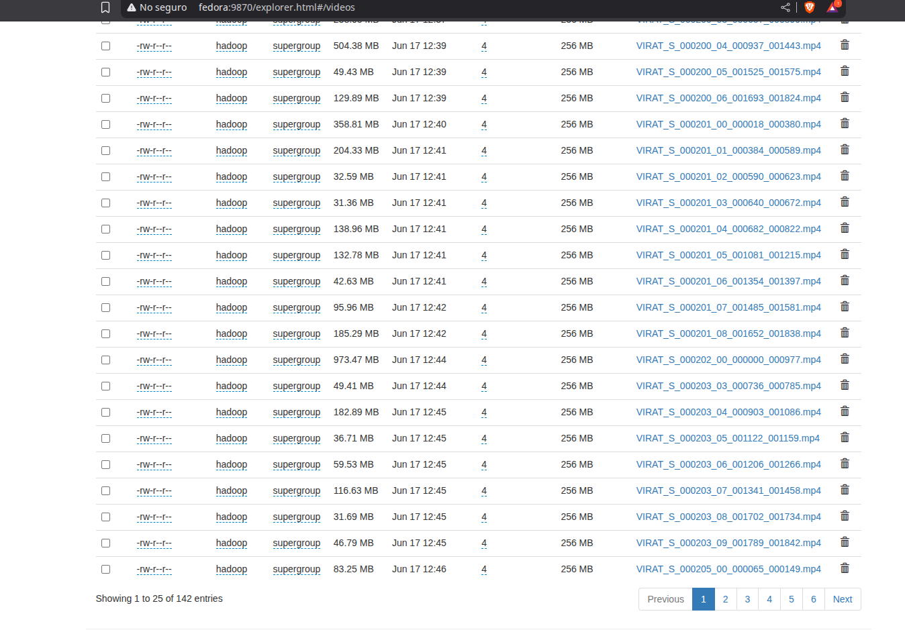
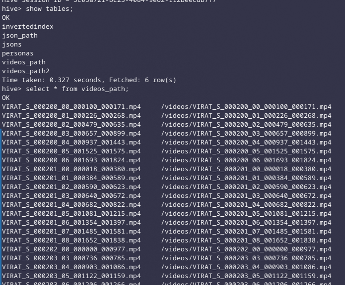
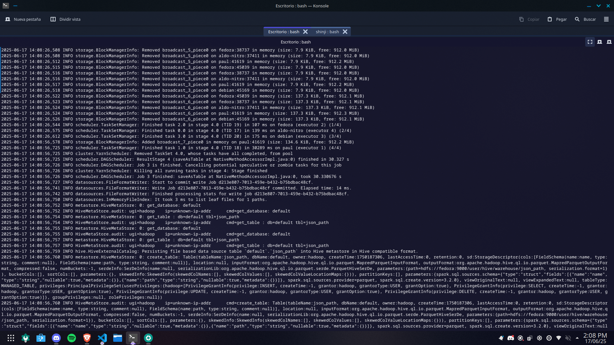
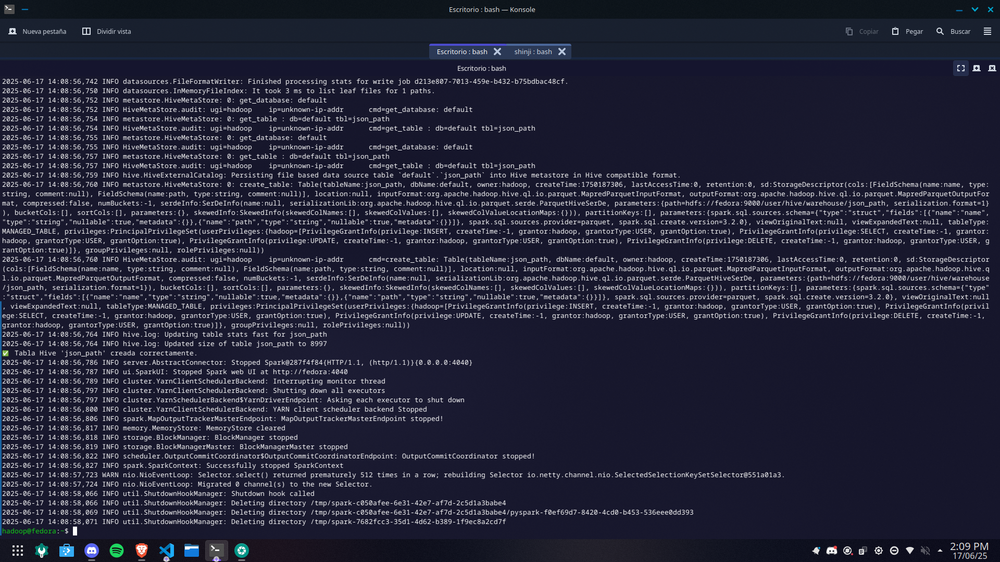
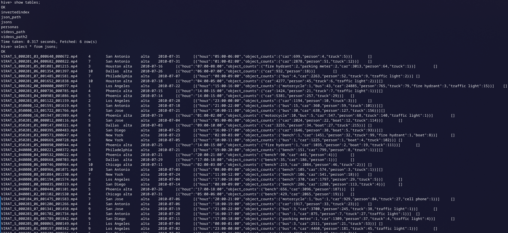

# Procesamiento de Videos con Hadoop y YOLOv8

## Prerrequisitos

### Instalar Python 3.9.18 con `pyenv`

#### 1. Instalar dependencias necesarias

```bash
sudo dnf install -y gcc zlib-devel bzip2 bzip2-devel \
readline-devel sqlite sqlite-devel openssl-devel \
xz xz-devel libffi-devel make git
```

#### 2. Instalar y configurar `pyenv`

```bash
curl https://pyenv.run | bash
```

Agregar al final del archivo `~/.bashrc`:

```bash
export PATH="$HOME/.pyenv/bin:$PATH"
eval "$(pyenv init -)"
eval "$(pyenv virtualenv-init -)"
```

Actualizar el entorno:

```bash
source ~/.bashrc
```

Verificar que `pyenv` esté disponible:

```bash
pyenv --version
```

#### 3. Instalar Python y crear entorno virtual

```bash
pyenv install 3.9.18
pyenv virtualenv 3.9.18 pyspark-env
pyenv activate pyspark-env
```

#### 4. Instalar librerías necesarias

```bash
python3 -m pip install opencv-python ultralytics
```

#### 5. Verificar instalación

```bash
python3 -c "import cv2; print('OpenCV OK')"
python3 -c "from ultralytics import YOLO; print('Ultralytics OK')"
```

### Configurar Spark con Python 3.9.18

Editar el archivo `~/.bashrc`:

```bash
nano ~/.bashrc
```

Agregar al final del archivo:

```bash
export PYSPARK_PYTHON="$HOME/.pyenv/versions/pyspark-env/bin/python"
export PYSPARK_DRIVER_PYTHON="$HOME/.pyenv/versions/pyspark-env/bin/python"
```

Actualizar el entorno:

```bash
source ~/.bashrc
```

Probar configuración abriendo Spark:

```bash
pyspark --master yarn
```

Y luego ejecutando en la consola de PySpark:

```python
import sys
print("Python executable:", sys.executable)
print("Python version:", sys.version)
```

La salida debe ser similar a:

```bash
>>> print(sys.executable)
/home/hadoop/.pyenv/versions/pyspark-env/bin/python
>>> print(sys.version)
3.9.18 (main, Jun 12 2025, 10:05:39)
[GCC 14.2.1 20240912 (Red Hat 14.2.1-3)]
```

### Subir modelo YOLOv8 a HDFS

#### 1. Crear carpeta para modelos en HDFS

```bash
hdfs dfs -mkdir -p /models
```

#### 2. Subir modelo YOLOv8

```bash
hdfs dfs -put yolov8n.pt /models/
```

#### 3. Verificar que el modelo esté en HDFS

```bash
hdfs dfs -ls /models
```

---

## Subir videos a HDFS

Automatiza la carga de videos a HDFS y deja una tabla Hive lista para consultas posteriores sin tener que manejar rutas manualmente.

### Pasos para ejecutar

1. Crea una carpeta llamada `videos` y coloca dentro todos los archivos `.mp4` que deseas subir.
2. Verifica que el script `upload_videos_to_hive.py` esté en el mismo nivel que la carpeta `videos`.

```
|-- videos
|    |-- *.mp4
|-- upload_videos_to_hive.py
```

3. Ejecuta el script con Spark en modo YARN:

```bash
spark-submit --master yarn upload_videos_to_hive.py
```

Este script realizará las siguientes tareas:

- Subirá todos los videos al HDFS bajo `/videoss/`
- Creará (o reemplazará) una tabla de Hive llamada `videos_path`
- Esta tabla contendrá dos columnas: `name` (nombre del video) y `path` (ruta en HDFS)

### Flujo del `upload_videos_to_hive.py`:

1. **Inicia una sesión de Spark con soporte para Hive.**
   Permite ejecutar comandos SQL y guardar tablas en Hive.

2. **Elimina la carpeta `/videos` en HDFS si ya existe.**
   Esto asegura que no haya archivos antiguos.

3. **Sube todos los archivos `.mp4` desde la carpeta local `./videos` a HDFS** en `/videos`.

4. **Crea un DataFrame con el nombre y la ruta HDFS de cada video.**

5. **Elimina la tabla Hive `videos_path` si existe y crea una nueva** con los datos cargados.

6. **Muestra en consola el contenido de la tabla** para verificar que se cargaron correctamente.

### Salidas





---

## Procesamiento de Videos con Spark y YOLOv8

El archivo `process.py` se encarga de analizar videos usando YOLOv8 y generar un resumen estructurado con información como:

- Nombre del video, cámara, ubicación, prioridad y fecha.
- Conteo de objetos por franjas horarias.
- Alertas detectadas (si hubiera).

```sql
video_name STRING,
camera_id INT,
location STRING,
priority STRING,
date STRING,
timeslots ARRAY<STRUCT<
    hour: STRING,
    object_counts: MAP<STRING, INT>
>>,
alerts ARRAY<STRING>
```

Los datos generados se guardan en una tabla Hive llamada `jsons`, lista para su análisis posterior.

### Ejecución

```bash
spark-submit --master yarn --num-executors <NUM_NODES> process.py
```

### Flujo del script `process.py`:

1. **Inicializa Spark con soporte Hive.**

2. **Crea tabla Hive `jsons`** con el esquema definido, almacenada en formato Parquet.

3. **Lee los paths de videos desde la tabla Hive `videos_path`.**

4. **Distribuye el procesamiento de videos entre los nodos** usando `.mapPartitions()`, donde:

   - Cada nodo descarga sus videos desde HDFS.
   - Usa YOLOv8 para detectar objetos.
   - Cuenta objetos por franjas horarias.
   - Retorna los resultados.

5. **Recoge los resultados procesados**:

   - Separa logs y resultados válidos.

6. **Inserta los resultados válidos en la tabla Hive `jsons`.**

7. **Crea la tabla Hive `json_path`** con (nombre, ruta) de los JSONs generados.

### Salidas






---
