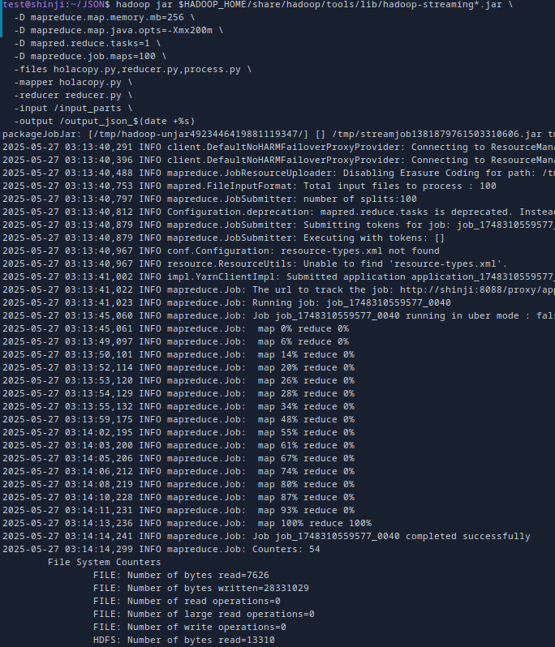
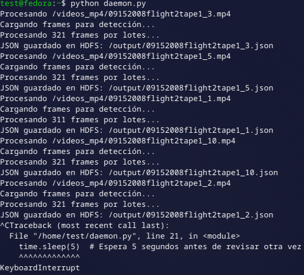
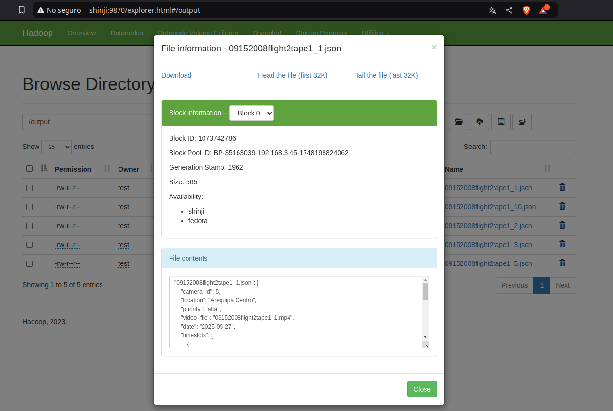

# Procesamiento de Videos con Hadoop y YOLOv8

Este proyecto implementa un sistema distribuido de análisis de videos usando **YOLOv8** sobre un clúster **Hadoop**. El sistema extrae información de los videos y genera archivos `.json` con los resultados, permitiendo procesamiento paralelo entre nodos.

---

## Prerequisitos

Antes de ejecutar cualquier procesamiento, debes subir los siguientes recursos a HDFS:

### 1. Crear carpetas necesarias en HDFS

```bash
hdfs dfs -mkdir -p /videos_mp4
hdfs dfs -mkdir -p /models
```

### 2. Subir videos al HDFS

Asumiendo que tus videos `.mp4` están en la carpeta local `videos_mp4/`:

```bash
hdfs dfs -put videos_mp4/* /videos_mp4/
```

### 3. Subir modelo YOLOv8

Asumiendo que el modelo `yolov8n.pt` está en tu directorio actual:

```bash
hdfs dfs -put yolov8n.pt /models/
```

> Revisa que ambos recursos se hayan subido correctamente con:

```bash
hdfs dfs -ls /videos_mp4
hdfs dfs -ls /models
```

---

## 🔍 Descripción General

- Se usa `process.py` para analizar videos mediante YOLOv8 y generar archivos `.json` con los objetos detectados.
- Para distribuir la carga en Hadoop Streaming, se implementó `holacopy.py`, que lee rutas de videos desde archivos `.txt` y las envía como input a los nodos.
- Cada nodo ejecuta un `daemon.py` que escucha nuevas rutas de videos desde un archivo local `/tmp/videos_a_procesar.txt` y lanza `process.py` cuando hay un nuevo video.
- El archivo `reducer.py` reporta qué videos se han procesado correctamente.
- Los `.json` generados por cada nodo se almacenan en una carpeta de salida dentro del HDFS.

---

## Cómo usarlo

### 1. Subir rutas de videos al HDFS

```bash
mkdir -p input_parts

for video in videos_mp4/*; do
  filename=$(basename "$video")
  echo "/videos_mp4/$filename" > "input_parts/${filename}.txt"
done

hdfs dfs -rm -r -f /input_parts
hdfs dfs -mkdir -p /input_parts
hdfs dfs -put input_parts/* /input_parts/
```

### 2. Ejecutar el trabajo MapReduce

```bash
hadoop jar $HADOOP_HOME/share/hadoop/tools/lib/hadoop-streaming*.jar \
  -files holacopy.py,reducer.py \
  -mapper holacopy.py \
  -reducer reducer.py \
  -input /input_parts \
  -output /output_resultados_yolo_$(date +%s)
```

---

## Requisitos por nodo

Cada nodo debe tener instalado:

```bash
pip install ultralytics opencv-python
```

Y debe contener en su directorio raíz:

- `process.py` — analiza un video y genera el `.json` correspondiente en HDFS.
- `daemon.py` — escucha el archivo `/tmp/videos_a_procesar.txt` y ejecuta `process.py` automáticamente cuando hay un nuevo video.

### Cómo iniciar el daemon en cada nodo

```bash
python daemon.py &
rm /tmp/videos_a_procesar.txt
```

Este demonio estará en espera de nuevas rutas y ejecutará automáticamente el procesamiento.

---

## Requisitos en el nodo maestro

Debe contener:

- `holacopy.py`
- `reducer.py`
- `process.py`
- `daemon.py`

El trabajo se lanza con:

```bash
hadoop jar $HADOOP_HOME/share/hadoop/tools/lib/hadoop-streaming*.jar \
  -files holacopy.py,reducer.py \
  -mapper holacopy.py \
  -reducer reducer.py \
  -input /input_parts \
  -output /output_resultados_yolo_$(date +%s)
```

Asegúrate de que el modelo YOLOv8 esté disponible en HDFS en:

```
hdfs dfs -ls /models/yolo8n.pt
```

---

## Test (modo multinodo aunque tengas pocos videos)

Genera 100 archivos a partir de los pocos videos disponibles para forzar paralelismo:

```bash
mkdir -p input_parts
rm -f input_parts/*

videos=(videos_mp4/*)
num_videos=${#videos[@]}

for ((i=0; i<100; i++)); do
  video="/${videos[$((i % num_videos))]}"
  echo "$video" > input_parts/part-$i.txt
done

hdfs dfs -rm -r -f /input_parts
hdfs dfs -mkdir -p /input_parts
hdfs dfs -put input_parts/* /input_parts/

hadoop jar $HADOOP_HOME/share/hadoop/tools/lib/hadoop-streaming*.jar \
  -D mapreduce.map.memory.mb=256 \
  -D mapreduce.map.java.opts=-Xmx200m \
  -D mapred.reduce.tasks=1 \
  -D mapreduce.job.maps=100 \
  -files holacopy.py,reducer.py,process.py \
  -mapper holacopy.py \
  -reducer reducer.py \
  -input /input_parts \
  -output /output_json_$(date +%s)
```

# Ejecución

## 1. Master



## 2. Nodo Esclavo



## 3. Salida en HDFS



