F# Motor de Búsqueda usando Hadoop

Hecho por:

1. MALDONADO CASILLA, BRAULIO NAYAP
2. MOGOLLÓN CÁCERES, SERGIO DANIEL
3. PARIZACA MOZO, PAUL ANTONY
4. MARTÍNEZ CHOQUE, ALDO RAÚL
5. APAZA APAZA, NELZON JORGE

## 1. Introducción

Este informe describe el desarrollo del motor de búsqueda distribuido utilizando el framework Apache Hadoop. Se implementaron dos algoritmos fundamentales: el **índice invertido** para la recuperación eficiente de documentos y **PageRank** para la evaluación de la relevancia. El sistema se ejecuta sobre un clúster de mínimo 3 nodos y emplea como fuente de datos archivos JSON relacionados con videovigilancia y resultados de detección de objetos en video.

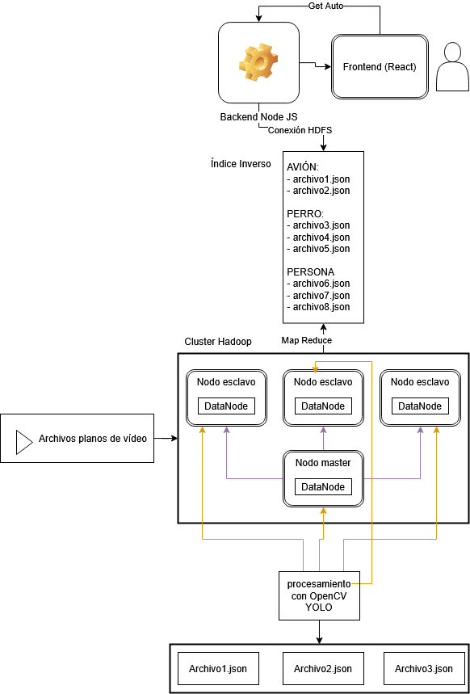

## 2. Prerequisitos

### 2.1 Configuración del Clúster Hadoop

#### 2.1.1 Topología y preparación

Clúster de cuatro nodos y Java 8:

| IP           | Hostname      |
| ------------ | ------------- |
| 10.7.135.140 | fedora        |
| 10.7.135.0   | debian        |
| 10.7.134.197 | paul (master) |
| 10.7.135.212 | aldo-nitro    |

- Instala Java, habilita SSH sin contraseña y genera claves.

```bash
sudo apt update
sudo apt install openjdk-8-jdk openssh-server
sudo adduser hadoop
sudo usermod -aG sudo hadoop
su - hadoop
ssh-keygen -t rsa
cat ~/.ssh/id_rsa.pub >> ~/.ssh/authorized_keys
```

- Descarga y despliega Hadoop 3.3.6.

```bash
wget https://dlcdn.apache.org/hadoop/common/hadoop-3.3.6/hadoop-3.3.6.tar.gz
tar xzf hadoop-3.3.6.tar.gz
mv hadoop-3.3.6 hadoop
```

- Configura las variables de entorno para Hadoop.

```bash
# Añadir a ~/.bashrc
export JAVA_HOME=/usr/lib/jvm/java-8-openjdk-amd64
export HADOOP_HOME=/home/hadoop/hadoop
export HADOOP_INSTALL=$HADOOP_HOME
export HADOOP_MAPRED_HOME=$HADOOP_HOME
export HADOOP_COMMON_HOME=$HADOOP_HOME
export HADOOP_HDFS_HOME=$HADOOP_HOME
export HADOOP_YARN_HOME=$HADOOP_HOME
export HADOOP_COMMON_LIB_NATIVE_DIR=$HADOOP_HOME/lib/native
export PATH=$PATH:$HADOOP_HOME/sbin:$HADOOP_HOME/bin
export HADOOP_OPTS="-Djava.library.path=$HADOOP_HOME/lib/native"
source ~/.bashrc
```

- Formatea el NameNode e inicia todos los servicios Hadoop/YARN.

```bash
hdfs namenode -format
start-all.sh
yarn node -list
```

#### 2.2.1 Configuración XML

##### `core-site.xml`

- Define el sistema de archivos por defecto y ajusta buffer I/O.

```xml
<configuration>
  <property><name>fs.defaultFS</name><value>hdfs://paul:9000</value></property>
  <property><name>io.file.buffer.size</name><value>65536</value></property>
</configuration>
```

##### `hdfs-site.xml`

- Configura replicación, directorios de datos, tamaño de bloque y buffers de socket.

```xml
<configuration>
  <property><name>dfs.replication</name><value>4</value></property>
  <property><name>dfs.name.dir</name><value>file:///home/hadoop/hadoopdata/hdfs/namenode</value></property>
  <property><name>dfs.data.dir</name><value>file:///home/hadoop/hadoopdata/hdfs/datanode</value></property>
  <property><name>dfs.blocksize</name><value>268435456</value></property>
  <property><name>dfs.client.socket.send.buffer.size</name><value>131072</value></property>
  <property><name>dfs.client.socket.receive.buffer.size</name><value>131072</value></property>
  <property><name>dfs.datanode.max.transfer.threads</name><value>16384</value></property>
  <property><name>dfs.permissions</name><value>false</value></property>
</configuration>
```

##### `mapred-site.xml`

- Indica que MapReduce corre sobre YARN y configura el JobHistory.

```xml
<configuration>
  <property><name>mapreduce.framework.name</name><value>yarn</value></property>
  <property><name>mapreduce.jobhistory.address</name><value>paul:10020</value></property>
  <property><name>mapreduce.jobhistory.webapp.address</name><value>paul:19888</value></property>
  <property><name>yarn.app.mapreduce.am.env</name><value>HADOOP_MAPRED_HOME=/home/hadoop/hadoop</value></property>
  <property><name>mapreduce.map.env</name><value>HADOOP_MAPRED_HOME=/home/hadoop/hadoop</value></property>
  <property><name>mapreduce.reduce.env</name><value>HADOOP_MAPRED_HOME=/home/hadoop/hadoop</value></property>
</configuration>
```

##### `yarn-site.xml`

- Define el ResourceManager y aux-servicios para shuffle.

```xml
<configuration>
  <property><name>yarn.resourcemanager.hostname</name><value>paul</value></property>
  <property><name>yarn.resourcemanager.scheduler.address</name><value>paul:8030</value></property>
  <property><name>yarn.resourcemanager.resource-tracker.address</name><value>paul:8025</value></property>
  <property><name>yarn.resourcemanager.admin.address</name><value>paul:8011</value></property>
  <property><name>yarn.nodemanager.aux-services</name><value>mapreduce_shuffle</value></property>
</configuration>
```

##### `workers`

```xml
paul
fedora
debian
aldo-nitro
```

### 2.2 Dataset de Videos

Para este proyecto se utilizó el dataset **VIRAT Video Dataset Release 2.0**, un conjunto de datos de aproximadamente **13 GB** de videos de vigilancia realistas, ideal para tareas de detección y análisis de actividades humanas.

El dataset puede descargarse desde el siguiente enlace oficial:

🔗 [VIRAT Video Dataset - Kitware](https://data.kitware.com/#collection/56f56db28d777f753209ba9f/folder/56f581ce8d777f753209ca43)


#### 2.2.1 Carga de videos en HDFS

Para que los nodos del clúster de Hadoop puedan procesar los videos, es necesario cargarlos en el sistema de archivos distribuido **HDFS**. A continuación, se detallan los pasos:

1. **Crear el directorio destino en HDFS:**

```bash
hdfs dfs -mkdir -p /videos_mp4
```

2. **Subir los archivos `.mp4` desde el sistema local:**

Asumiendo que los videos se encuentran en el directorio local `videos_mp4/`:

```bash
hdfs dfs -put videos_mp4/* /videos_mp4/
```

Esto almacena todos los videos en el directorio `/videos_mp4/` de HDFS, donde estarán disponibles para su procesamiento distribuido.


### 2.3 Preparación de Nodos

Cada nodo debe tener instalado:

```bash
pip install ultralytics opencv-python
```

Y debe contener en su directorio raíz:

- `process.py` — analiza un video y genera el `.json` correspondiente en HDFS.
- `daemon.py` — escucha el archivo `/tmp/videos_a_procesar.txt` y ejecuta `process.py` automáticamente cuando hay un nuevo video.

## 3. Procesamiento de Videos

Se implementa un sistema distribuido de análisis de videos usando **YOLOv8** sobre un clúster **Hadoop**. El sistema extrae información de los videos y genera archivos `.json` con los resultados, permitiendo procesamiento paralelo entre nodos.

### 3.1 Subir modelo YOLOv8

Asumiendo que el modelo `yolov8n.pt` está en tu directorio actual:

```bash
hdfs dfs -put yolov8n.pt /models/
```

> Revisa que ambos recursos se hayan subido correctamente con:

```bash
hdfs dfs -ls /videos_mp4
hdfs dfs -ls /models
```

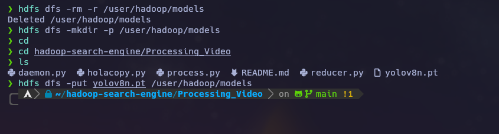

### 3.2 Descripción de Proceso

- Se usa `process.py` para analizar videos mediante YOLOv8 y generar archivos `.json` con los objetos detectados.

```python
import cv2
from ultralytics import YOLO
import json
import os
from datetime import datetime, timedelta
from collections import defaultdict
import subprocess
import sys
import random

local_model_path = "/tmp/yolov8n.pt"
hdfs_model_path = "/models/yolov8n.pt"

if not os.path.exists(local_model_path):
    print(f"Copiando modelo desde HDFS {hdfs_model_path} a local {local_model_path}")
    subprocess.run(["hdfs", "dfs", "-copyToLocal", hdfs_model_path, local_model_path], check=True)

MODEL_PATH = local_model_path
FPS_ANALYSIS = 1
ciudades_arequipa = [
        "Arequipa Centro",
        "Yanahuara",
        "Cayma",
        "José Luis Bustamante y Rivero",
        "Sabandía"
    ]
model = YOLO(MODEL_PATH)
def analyze_video(video_path):
    filename = os.path.basename(video_path)

    camera_id = random.randint(0, 5)
    location = random.choice(ciudades_arequipa)
    date = datetime.now().strftime("%Y-%m-%d")

    cap = cv2.VideoCapture(video_path)
    fps = cap.get(cv2.CAP_PROP_FPS)
    frame_interval = int(fps * FPS_ANALYSIS)
    base_time = datetime.strptime(date + " 00:00:00", "%Y-%m-%d %H:%M:%S")

    frame_index = 0
    frames_to_analyze = []

    print("Cargando frames para detección...")

    while cap.isOpened():
        ret, frame = cap.read()
        if not ret:
            break

        if frame_index % frame_interval == 0:
            frames_to_analyze.append((frame_index, frame.copy()))

        frame_index += 1

    cap.release()

    print(f"Procesando {len(frames_to_analyze)} frames por lotes...")
    batch_size=1
    counts_by_hour = defaultdict(lambda: defaultdict(int))
    random_hour = random.randint(0, 23)
    start_hour_str = f"{random_hour:02d}:00"
    end_hour = (random_hour + 1) % 24
    end_hour_str = f"{end_hour:02d}:00"
    hour_slot = f"{start_hour_str}-{end_hour_str}"
    for i in range(0, len(frames_to_analyze), batch_size):
        batch = frames_to_analyze[i:i+batch_size]
        frames_batch = [f[1] for f in batch]
        try:
            detections = model(frames_batch, verbose=False)
            for (_, _), result in zip(batch, detections):
                for det in result.boxes.data.tolist():
                    cls_id = int(det[5])
                    cls_name = model.names[cls_id]
                    counts_by_hour[hour_slot][cls_name] += 1
        except Exception as e:
            print(f"⚠️  Error procesando lote desde frame {batch[0][0]}: {e}", file=sys.stderr)
            continue

    output = {
        "camera_id": camera_id,
        "location": location,
        "priority": "alta",
        "video_file": filename,
        "date": date,
        "timeslots": [
            {
                "hour": hour,
                "object_counts": dict(counts_by_hour[hour])
            } for hour in sorted(counts_by_hour)
        ],
        "alerts": []
    }

    return output

def save_custom_json(path, key, data):
    with open(path, "w", encoding="utf-8") as f:
        f.write(f'"{key}": ')
        json.dump(data, f, indent=4, ensure_ascii=False)
        f.write("\n")

def run_mapper():
    for line in sys.stdin:
        video_hdfs = line.strip()
        if not video_hdfs:
            continue
        try:
            print(f"Procesando video: {video_hdfs}", file=sys.stderr)
            local_video = "/tmp/" + os.path.basename(video_hdfs)
            if os.path.exists(local_video):
                os.remove(local_video)
            subprocess.run(["hdfs", "dfs", "-copyToLocal", video_hdfs, local_video], check=True)

            result = analyze_video(local_video)

            json_basename = os.path.splitext(os.path.basename(video_hdfs))[0] + ".json"
            local_json = "/tmp/" + json_basename
            json_hdfs = "/output/" + json_basename

            save_custom_json(local_json, json_basename, result)

            subprocess.run(["hdfs", "dfs", "-copyFromLocal", "-f", local_json, json_hdfs], check=True)
            print(f"JSON guardado en HDFS: {json_hdfs}", file=sys.stderr)

            os.remove(local_video)
            os.remove(local_json)

        except Exception as e:
            print(f"Error procesando {video_hdfs}: {e}", file=sys.stderr)

def main():
    if len(sys.argv) == 4 and sys.argv[1] == "--local":
        video_path = sys.argv[2]
        json_path = sys.argv[3]

        print(f"Modo local: analizar video {video_path} y guardar JSON en {json_path}")
        result = analyze_video(video_path)
        video_basename = os.path.basename(video_path)
        json_key = os.path.splitext(video_basename)[0] + ".json"

        save_custom_json(json_path, json_key, result)
        print(f"✅ JSON generado localmente: {json_path}")
        return
    if len(sys.argv) == 2:
        video_hdfs = sys.argv[1]
        video_basename = os.path.basename(video_hdfs)
        json_basename = os.path.splitext(video_basename)[0] + ".json"
        json_hdfs = "/output/" + json_basename

        local_video = "/tmp/" + video_basename
        local_json = "/tmp/" + json_basename
        if os.path.exists(local_video):
            os.remove(local_video)
        subprocess.run(["hdfs", "dfs", "-copyToLocal", video_hdfs, local_video], check=True)
        result = analyze_video(local_video)

        video_basename = os.path.basename(local_video)
        save_custom_json(local_json, json_basename, result)

        subprocess.run(["hdfs", "dfs", "-copyFromLocal", "-f", local_json, json_hdfs], check=True)
        print(f"JSON guardado en HDFS: {json_hdfs}")
        os.remove(local_video)
        os.remove(local_json)
        return
    run_mapper()
if __name__ == "__main__":
    main()
```

- Para distribuir la carga en Hadoop Streaming, se implementó `holacopy.py`, que lee rutas de videos desde archivos `.txt` y las envía como input a los nodos.

```python
import sys
import socket

for line in sys.stdin:
    video = line.strip()
    with open("/tmp/videos_a_procesar.txt", "a") as f:
        f.write(video + "\n")
    print(f"Hola mundo desde nodo {socket.gethostname()} with {video}")
```

- Cada nodo ejecuta un `daemon.py` que escucha nuevas rutas de videos desde un archivo local `/tmp/videos_a_procesar.txt` y lanza `process.py` cuando hay un nuevo video.

```python
import time
import subprocess
import os

archivo_videos = "/tmp/videos_a_procesar.txt"
procesados = set()

while True:
    if os.path.exists(archivo_videos):
        with open(archivo_videos, "r") as f:
            videos = [line.strip() for line in f if line.strip()]

        for video in videos:
            if video not in procesados:
                print(f"Procesando {video}")
                subprocess.run(['python3', 'process.py', video])
                procesados.add(video)
    time.sleep(5)
```

- El archivo `reducer.py` reporta qué videos se han procesado correctamente.

```python
import sys

for line in sys.stdin:
    print(line.strip())
```

- Los `.json` generados por cada nodo se almacenan en una carpeta de salida dentro del HDFS.

### 3.3 Subir rutas de videos al HDFS

```bash
mkdir -p input_parts

for video in videos_mp4/*; do
  filename=$(basename "$video")
  echo "/videos_mp4/$filename" > "input_parts/${filename}.txt"
done

hdfs dfs -rm -r -f /input_parts
hdfs dfs -mkdir -p /input_parts
hdfs dfs -put input_parts/* /input_parts/
```

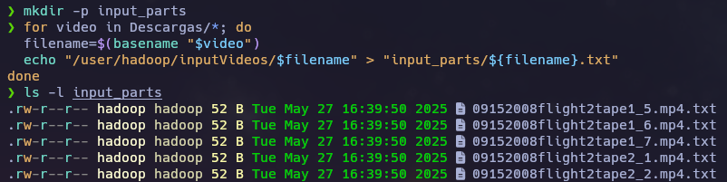

### 3.4 Ejecutar el trabajo MapReduce

```bash
hadoop jar $HADOOP_HOME/share/hadoop/tools/lib/hadoop-streaming*.jar \
  -files holacopy.py,reducer.py \
  -mapper holacopy.py \
  -reducer reducer.py \
  -input /input_parts \
  -output /output_resultados_yolo_$(date +%s)
```

### 3.5 Requisitos por nodo

```bash
python daemon.py &
rm /tmp/videos_a_procesar.txt
```

Este demonio estará en espera de nuevas rutas y ejecutará automáticamente el procesamiento.

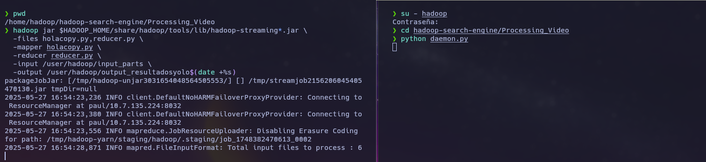

### 3.6 Requisitos en el nodo maestro

Debe contener:

- `holacopy.py`
- `reducer.py`
- `process.py`
- `daemon.py`

El trabajo se lanza con:

```bash
hadoop jar $HADOOP_HOME/share/hadoop/tools/lib/hadoop-streaming*.jar \
  -files holacopy.py,reducer.py \
  -mapper holacopy.py \
  -reducer reducer.py \
  -input /input_parts \
  -output /output_resultados_yolo_$(date +%s)
```

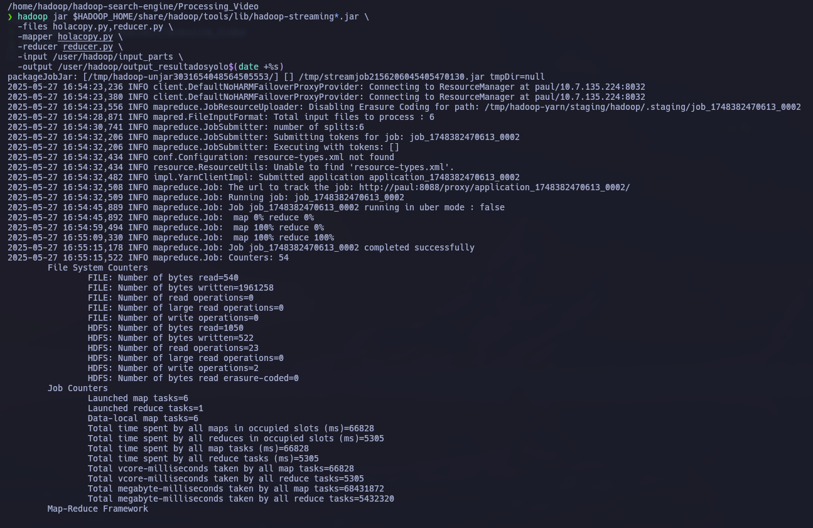

### 3.7 Salidas

- Application job:
  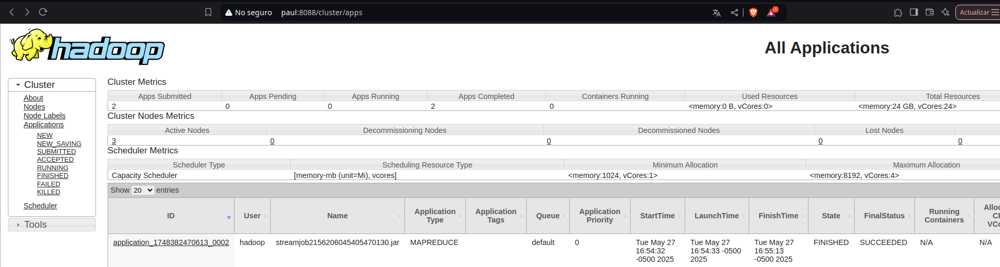

- HDFS:
  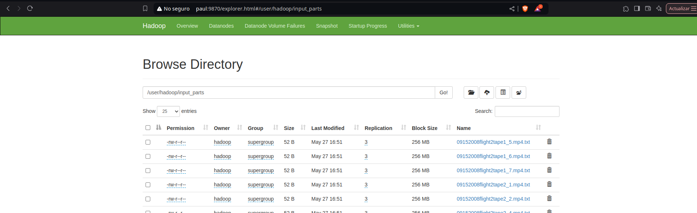
- Json in HDFS:
  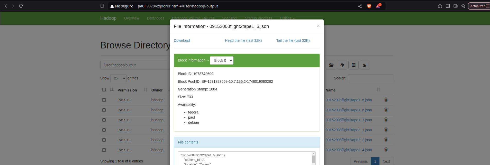

## 4. Modulo: Indice Invertido

Este flujo de trabajo tiene como objetivo la creación de un índice invertido a partir de los metadatos de videos almacenados en archivos JSON. El proceso se lleva a cabo en un entorno Hadoop utilizando MapReduce. Los archivos JSON contienen información relevante sobre los videos, y el índice invertido se construye a partir de las palabras y fechas presentes en dichos metadatos.

### Flujo de Trabajo:

1. **Generación de los archivos JSON**:
   En un proceso previo, se generan archivos JSON que contienen la metadata de los videos, estos archivos se colocan en el directorio `/user/hadoop/output` dentro de HDFS.

2. **Ejecutando el comando de Hadoop**:
   Se ejecuta el siguiente comando para crear el índice invertido:

   ```
   hadoop jar inverted-index-1.0-SNAPSHOT.jar /user/hadoop/output /user/hadoop/outputJson
   ```

   Este comando procesa los archivos JSON de metadatos que están en `/user/hadoop/output` y genera el índice invertido en el directorio `/user/hadoop/outputJson` de HDFS.

3. **Procesamiento posterior**:
   Una vez generado el índice invertido, el backend de la aplicación tomará los archivos en `/user/hadoop/outputJson` para realizar el procesamiento adicional y generar la información que se utilizará en el análisis de los datos.

Ahora, el proceso de MapReduce que hemos implementado consta de tres clases principales:

- **InvertedIndexMapper.java**: Esta clase es responsable de mapear los datos de entrada y extraer las palabras y fechas relevantes.
- **InvertedIndexReducer.java**: Esta clase agrupa las palabras por su aparición en los documentos y construye el índice invertido.
- **InvertedIndexDriver.java**: Es el controlador que configura y ejecuta el trabajo de MapReduce.

### Código de las Clases

A continuación se muestra el código completo de cada una de las clases mencionadas.

---

### **1. InvertedIndexMapper.java**

```java
package com.example;

import java.io.IOException;
import java.util.StringTokenizer;
import java.util.regex.Matcher;
import java.util.regex.Pattern;

import org.apache.hadoop.io.LongWritable;
import org.apache.hadoop.io.Text;
import org.apache.hadoop.mapreduce.Mapper;
import org.apache.hadoop.mapreduce.lib.input.FileSplit;

public class InvertedIndexMapper extends Mapper<LongWritable, Text, Text, Text> {

  private Text word = new Text();
  private Text documentId = new Text();
  // Patrón para fechas como DD-MM-AA o similares (ajusta si es necesario)
  private Pattern datePattern = Pattern.compile("\\b\\d{2}-\\d{2}-\\d{2}\\b");

  @Override
  protected void map(LongWritable key, Text value, Context context) throws IOException, InterruptedException {
    // Obtener el nombre del archivo
    FileSplit fileSplit = (FileSplit) context.getInputSplit();
    String filename = fileSplit.getPath().getName();
    documentId.set(filename);

    String line = value.toString().toLowerCase();

    // 1. Extraer y procesar fechas primero
    Matcher dateMatcher = datePattern.matcher(line);
    while (dateMatcher.find()) {
      word.set(dateMatcher.group());
      context.write(word, documentId);
    }
    // Remover fechas para no procesarlas de nuevo y limpiar caracteres no deseados
    line = dateMatcher.replaceAll(" ");
    line = line.replaceAll("[{}:\",]", " "); // Ignora {}, :, "", y también puntos y comas.

    // 2. Tokenizar el resto
    StringTokenizer itr = new StringTokenizer(line);
    while (itr.hasMoreTokens()) {
      String token = itr.nextToken();

      // Verificar si el token es válido (no vacío y contiene alfanuméricos)
      if (token.matches(".*[a-z0-9].*")) {
        word.set(token);
        context.write(word, documentId);
      }
    }
  }
}
```

### **2. InvertedIndexReducer.java**

```java
package com.example;

import java.io.IOException;
import java.util.HashSet;
import java.util.Set;

import org.apache.hadoop.io.Text;
import org.apache.hadoop.mapreduce.Reducer;

public class InvertedIndexReducer extends Reducer<Text, Text, Text, Text> {

  private Text result = new Text();

  @Override
  protected void reduce(Text key, Iterable<Text> values, Context context)
      throws IOException, InterruptedException {
    Set<String> documentSet = new HashSet<>();
    // Usar un Set para evitar duplicados de nombres de archivo para la misma
    // palabra
    for (Text val : values) {
      documentSet.add(val.toString());
    }

    // Construir la cadena de documentos
    StringBuilder docList = new StringBuilder();
    boolean first = true;
    for (String docId : documentSet) {
      if (!first) {
        docList.append(", ");
      }
      docList.append(docId);
      first = false;
    }

    result.set(docList.toString());
    context.write(key, result);
  }
}
```

### **3. InvertedIndexDriver.java**

```java
package com.example;

import org.apache.hadoop.conf.Configuration;
import org.apache.hadoop.fs.Path;
import org.apache.hadoop.io.Text;
import org.apache.hadoop.mapreduce.Job;
import org.apache.hadoop.mapreduce.lib.input.FileInputFormat;
import org.apache.hadoop.mapreduce.lib.output.FileOutputFormat;
import org.apache.hadoop.fs.FileSystem;

public class InvertedIndexDriver {

  public static void main(String[] args) throws Exception {
    Configuration conf = new Configuration();
    Job job = Job.getInstance(conf, "Inverted Index Hadoop 3.3.6");

    job.setJarByClass(InvertedIndexDriver.class);
    job.setMapperClass(InvertedIndexMapper.class);
    job.setReducerClass(InvertedIndexReducer.class);

    job.setOutputKeyClass(Text.class);
    job.setOutputValueClass(Text.class);

    // Usar Text.class para Mapper si emite Text, Text
    job.setMapOutputKeyClass(Text.class);
    job.setMapOutputValueClass(Text.class);

    Path inputPath = new Path(args[0]);
    Path outputPath = new Path(args[1]);

    // Asegurarse de que el directorio de salida no exista
    FileSystem fs = FileSystem.get(conf);
    if (fs.exists(outputPath)) {
      fs.delete(outputPath, true); // true para borrar recursivamente
      System.out.println("Directorio de salida existente borrado: " + outputPath);
    }

    FileInputFormat.addInputPath(job, inputPath);
    FileOutputFormat.setOutputPath(job, outputPath);

    System.exit(job.waitForCompletion(true) ? 0 : 1);
  }
}
```

---

- **InvertedIndexMapper**: Mapea cada línea de los archivos JSON, extrayendo las palabras clave y las fechas. Cada palabra o fecha se asocia con el documento en el que se encuentra.
- **InvertedIndexReducer**: Recibe las palabras clave emitidas por el Mapper y las agrupa por documento, eliminando duplicados. Luego, construye una lista de documentos que contiene cada palabra.
- **InvertedIndexDriver**: Es el encargado de configurar y ejecutar el trabajo de MapReduce en Hadoop, manejando los directorios de entrada y salida.

---

### Ejecución del Índice Invertido en Hadoop

Una vez configurado el flujo de trabajo y ejecutado el trabajo MapReduce en Hadoop, se genera el índice invertido basado en los archivos de metadatos de los videos (JSON). A continuación, se muestra cómo se ve el flujo de datos desde la entrada hasta la salida:

#### 1. **Directorio de Entrada (Input JSON)**

El directorio `/user/hadoop/output` contiene los archivos de entrada con los metadatos de los videos en formato JSON. Esta es la entrada de nuestro trabajo MapReduce, donde cada archivo JSON contiene información relevante sobre los videos. A continuación, se muestra cómo se ve este directorio:

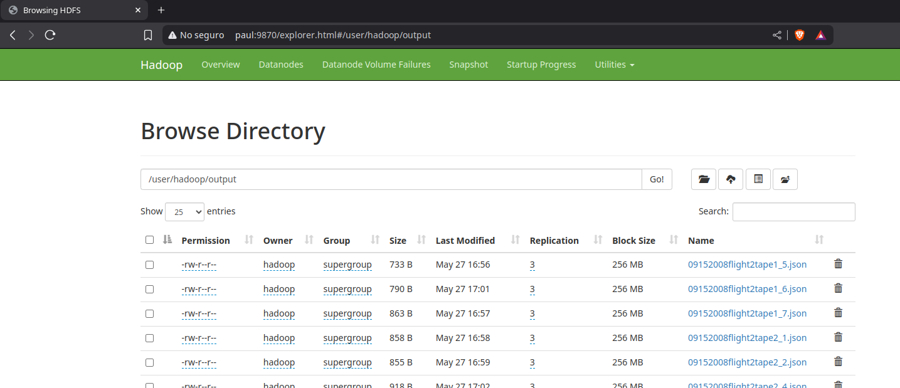

#### 2. **Ejecución del Comando Hadoop**

El siguiente paso es la ejecución del comando Hadoop que inicia el trabajo MapReduce. Las siguientes imágenes muestran los logs de la ejecución de este proceso, donde se puede ver cómo el trabajo se lanza, los mapas y reduce completados, y las estadísticas de procesamiento.

##### **Parte 1 de la Ejecución del Jar**

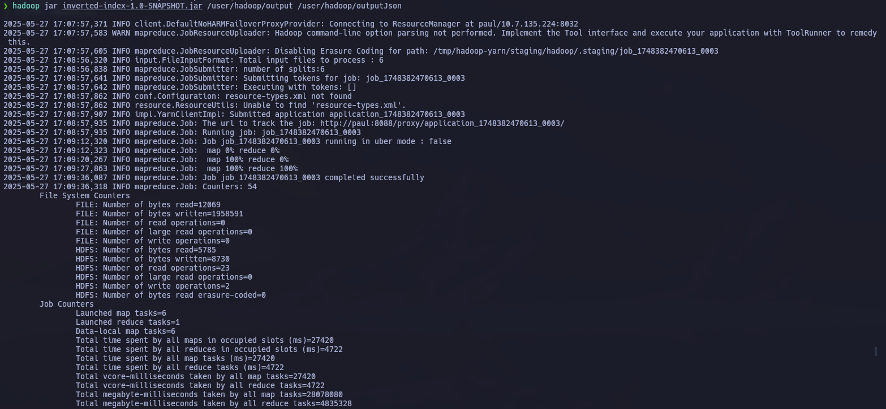

##### **Parte 2 de la Ejecución del Jar**

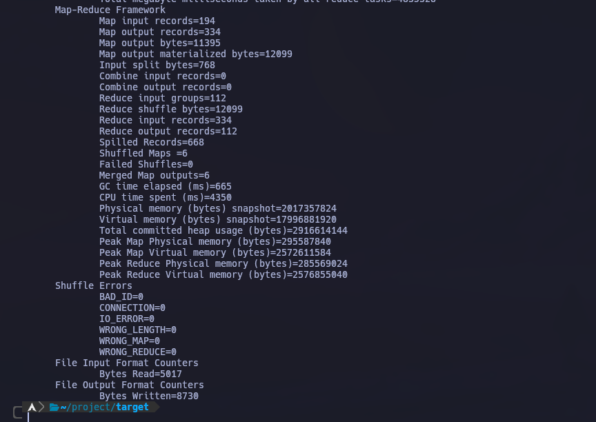

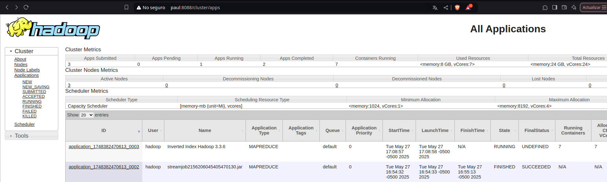

#### 3. **Índice Invertido Generado**

Una vez que el trabajo MapReduce ha sido ejecutado, se genera un índice invertido. Este índice lista las palabras o fechas junto con los documentos (en este caso, los archivos JSON) en los que se encuentran. A continuación se muestra un ejemplo del índice invertido generado:

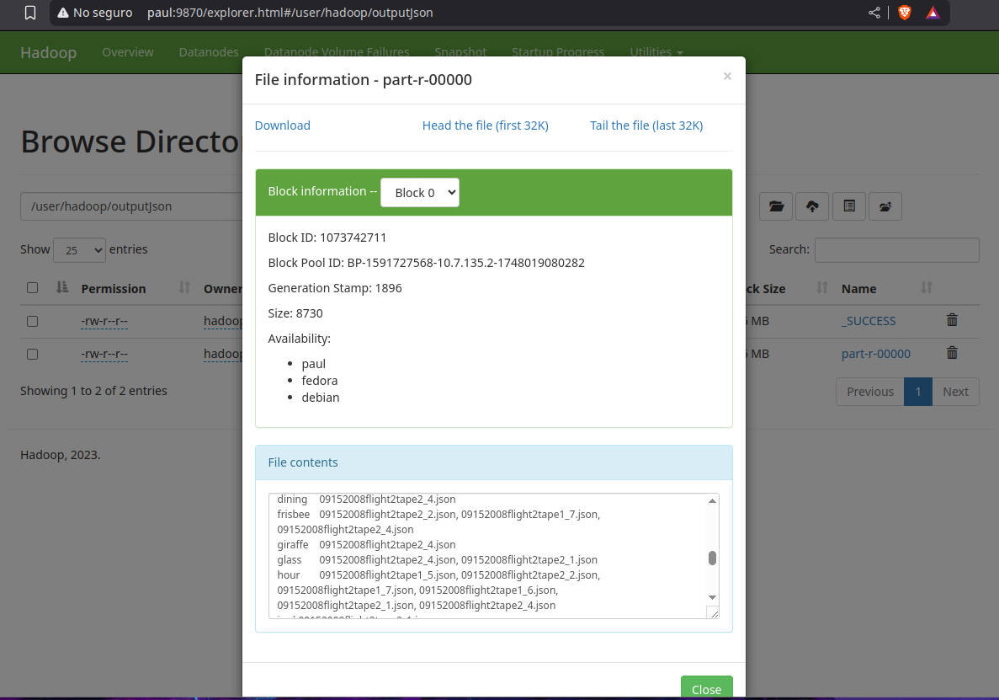

#### 4. **Salida del Trabajo MapReduce (Output JSON)**

Después de la ejecución del trabajo, los resultados se almacenan en el directorio `/user/hadoop/outputJson`. Este directorio contiene los archivos con los resultados del índice invertido, que serán procesados por el backend para análisis adicionales. A continuación, se muestra cómo se ve este directorio:

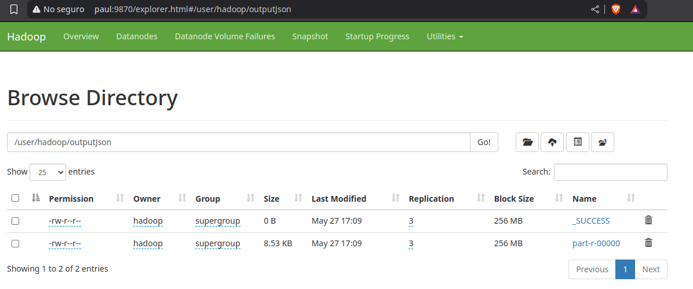

### Resumen del Flujo

1. **Archivos de Entrada**: Los archivos JSON de metadatos de los videos son cargados en el directorio `/user/hadoop/output`.
2. **Procesamiento con Hadoop**: El trabajo MapReduce es ejecutado con el comando `hadoop jar inverted-index-1.0-SNAPSHOT.jar /user/hadoop/output /user/hadoop/outputJson`, que genera el índice invertido.
3. **Índice Invertido**: El resultado es almacenado en el directorio `/user/hadoop/outputJson`, el cual contiene las listas de documentos indexados por cada palabra o fecha.

Este proceso crea un índice eficiente para buscar y analizar las palabras o fechas en los metadatos de los videos.

## 5. Módulo: Cliente - Frontend

Se desarrolló una interfaz de usuario (frontend) utilizando **React**, la cual permite a los usuarios realizar búsquedas a través de una experiencia similar a la de Google.


Al ingresar una consulta en la página inicial, se utiliza un pequeño módulo de **procesamiento de lenguaje natural (NLP)** para extraer las palabras clave. Estas se envían al servidor backend, que actúa como intermediario entre el frontend y el sistema de almacenamiento distribuido **HDFS**.

El backend consulta un **índice invertido** almacenado en HDFS para determinar qué archivos JSON están asociados a los términos buscados. Luego, vuelve a acceder a HDFS para recuperar el contenido de los JSON identificados y los envía al frontend, donde se presentan en una lista de resultados.

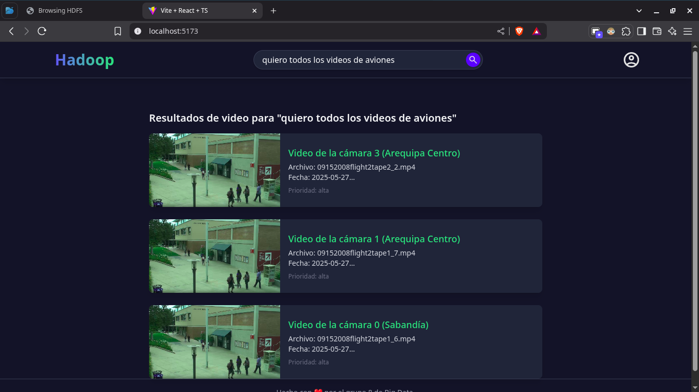

Cada resultado incluye una previsualización del video correspondiente. Al hacer clic sobre uno, se carga el video completo usando un sistema de **streaming con cabeceras HTTP tipo "Range"**, que permite transmitir segmentos de aproximadamente 1 MB por segundo. Estos videos están almacenados directamente en HDFS y se sirven en tiempo real.
Se implemento un frontend con React que se conecta al servidor backedn, que este se conecta con el HDFS.
En el frontend se implemento un NLP que procesa las consultas en la pagina inciial y busca las palabras claves consultando al backend que este solicitara como DATABASE el HDFS el indice invertido. que le dara los nombres de los json, y luego vuelve a consultar al hdfs para que le retorne los json y pueda exportarlos en el frontend mediante visualizacion.
Para la parte de carga del video se incluyo streaming con caebceras rango de bits a transmitir que carga 1mb x sec, y los videos estan siendo cargados por los videos almacenados en el HDFS.

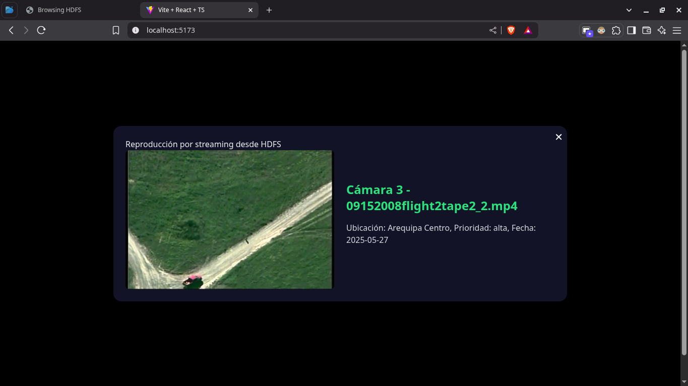

### 6. Problemas y Desafios

1.  **Ejecutar YOLO en Cada Nodo Esclavo**

    - **Problema**: Necesitábamos ejecutar el modelo YOLO en cada nodo esclavo de Hadoop desde el nodo master.
    - **Desafío**: Asegurar que cada nodo pueda ejecutar el modelo correctamente y de manera eficiente, sin sobrecargar la memoria ni los recursos.

2.  **Conexión entre HDFS y el Backend (Node.js)**

    - **Problema**: El backend (hecho en Node.js con Express) necesitaba acceder a los archivos generados en HDFS.
    - **Desafío**: Integrar HDFS con Node.js no es algo sencillo. Usamos bibliotecas como `hdfs` para leer los archivos desde HDFS, pero a veces hubo problemas con la conexión y el acceso concurrente.

3.  **Flujo de Datos de HDFS a Backend**

    - **Problema**: El flujo de trabajo consistía en leer los archivos JSON desde HDFS y procesarlos en el backend.
    - **Desafío**: Convertir esos archivos en un formato útil para que el backend pueda hacer las búsquedas o consultas rápidamente.

4.  **Optimización de las Consultas de Búsqueda**

    - **Problema**: El frontend necesita hacer búsquedas rápidas por videos y objetos.
    - **Desafío**: Al manejar grandes volúmenes de datos, las búsquedas podían ser lentas, por lo que tuvimos que optimizar cómo hacer las consultas entre el backend y HDFS.

5.  **Integración del Backend con el Frontend (React)**

    - **Problema**: El frontend en React necesitaba mostrar los resultados de las búsquedas que hace el usuario, pero estos datos vienen del backend.
    - **Desafío**: Asegurar que la comunicación entre el backend (Express) y el frontend (React) fuera fluida y rápida para que los usuarios pudieran ver los resultados sin retrasos.

### 7. Conclusiones

Se logró implementar satisfactoriamente un sistema distribuido utilizando **Hadoop**, capaz de procesar tanto datos como videos de manera eficiente. A través del uso de HDFS como base de almacenamiento, se desarrolló un flujo de trabajo que permite a un cliente (frontend) realizar búsquedas y visualizar videos procesados, con apoyo de un backend que actúa como puente entre el usuario y la data en Hadoop.

Este trabajo demuestra que Hadoop puede funcionar no solo como una herramienta de procesamiento masivo, sino también como una **base de datos distribuida** central que respalda la operación de aplicaciones web completas, incluyendo análisis, recuperación de información, y transmisión multimedia.

### 8. Equipo de trabajo

| Nombre                           | Porcentaje | Actividad realizada                                                                     |
| -------------------------------- | ---------- | --------------------------------------------------------------------------------------- |
| MALDONADO CASILLA, BRAULIO NAYAP | 20%        | Implementación de YOLO con procesamiento de nodos ordenado mediante MapReduce en Hadoop |
| MOGOLLÓN CÁCERES, SERGIO DANIEL  | 20%        | Implementación del backend y conexión entre el frontend y HDFS                          |
| PARIZACA MOZO, PAUL ANTONY       | 20%        | Implementación del índice invertido utilizando Hadoop                                   |
| MARTÍNEZ CHOQUE, ALDO RAÚL       | 20%        | Implementación del frontend                                                             |
| APAZA APAZA, NELZON JORGE        | 20%        | Implementación del módulo de procesamiento de lenguaje natural (NLP)                    |

## License

This project is licensed under the MIT License. See the [LICENSE](LICENSE) file for details.
