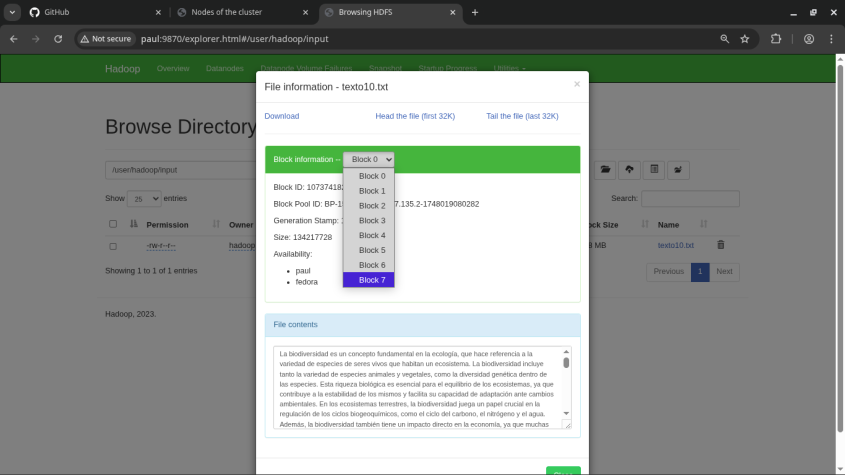
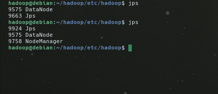
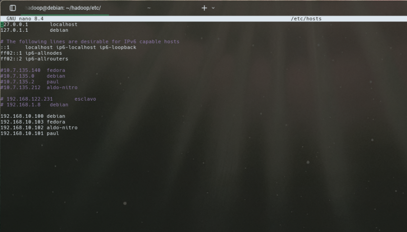

# Informe de Proyecto: Motor de Búsqueda usando Hadoop

## Carátula

**Curso:** Big Data   
**Proyecto:** Motor de Búsqueda Distribuido con Hadoop y algoritmos: indice invertido y pagerank 
**Integrantes del grupo:**
1. MALDONADO CASILLA, BRAULIO NAYAP
2. MOGOLLON CACERES, SERGIO DANIEL
3. PARIZACA MOZO, PAUL ANTONY
4. MARTINEZ CHOQUE, ALDO RAUL
5. APAZA APAZA, NELZON JORGE

---

## 1. Introducción

Este informe describe el desarrollo del motor de búsqueda distribuido utilizando el framework Apache Hadoop. Se implementaron dos algoritmos fundamentales: el **índice invertido** para la recuperación eficiente de documentos y **PageRank** para la evaluación de la relevancia. El sistema se ejecuta sobre un clúster de mínimo 3 nodos y emplea como fuente de datos archivos JSON relacionados con videovigilancia.

---

## 2. Generación y Preparación de Datos

### 2.1 Descripción de los Archivos de Entrada

- cam_01_entrada_principal_2024-04-13.json  
- cam_02_pasillo_b_2024-04-13.json  
- cam_03_bicicleteros_2024-04-13.json

Estos archivos están inspirados en el dataset **VIRAT Video Dataset** (https://viratdata.org/), y contienen metadatos de eventos detectados en distintas cámaras de vigilancia.

### 2.2 Proceso de Generación de Datos Sintéticos

................... [Aquí explicamos cómo se generaron datos similares, si no se usaron directamente los originales.........

### 2.3 Carga al HDFS

Describir cómo se cargaron los datos al Hadoop Distributed File System (HDFS), herramientas utilizadas (CLI, WebUI, etc.), y comandos relevantes.

---

## 3. Implementación de Algoritmos

### 3.1 Índice Invertido

- Principios teóricos.
- Implementación en Hadoop MapReduce.
- Estructura de los pares clave-valor.
- Resultados generados y cómo se almacenan.

### 3.2 PageRank

- Descripción del algoritmo.
- Adaptación para un conjunto de documentos JSON.
- Uso de MapReduce para múltiples iteraciones.
- Visualización o interpretación de los puntajes de relevancia.

---

## 4. Arquitectura del Motor de Búsqueda

### 4.1 Diagrama General

............ Aqui ponemos un diagrama que muestre el flujo de datos: ingreso → procesamiento (MapReduce) → almacenamiento → interfaz de búsqueda ...............

### 4.2 Componentes Principales

- Carga en HDFS
- Job de Índice Invertido
- Job de PageRank
- Servicio web o interfaz de búsqueda

---

## 5. Interfaz del Motor de Búsqueda

Describir:
- Herramientas utilizadas (por ejemplo: Flask, Node.js, Java)
- Funcionalidades: búsqueda por palabra clave, orden por relevancia
- Integración con HDFS y resultados de MapReduce

---

## 6. Desafíos y Problemas Encontrados

- Problemas técnicos al configurar el clúster
- Errores comunes en MapReduce
- Dificultades en la integración de los algoritmos
- Retos en la interfaz gráfica
- Soluciones adoptadas o problemas pendientes

---

## 7. Conclusiones

Resumen de los logros del proyecto, aprendizajes y posibles mejoras futuras.

---

## 8. Anexos

- Comandos utilizados en Hadoop
- Fragmentos de código relevantes (índice invertido, PageRank)
- Capturas de pantalla
- Logs del clúster o tiempos de ejecución

