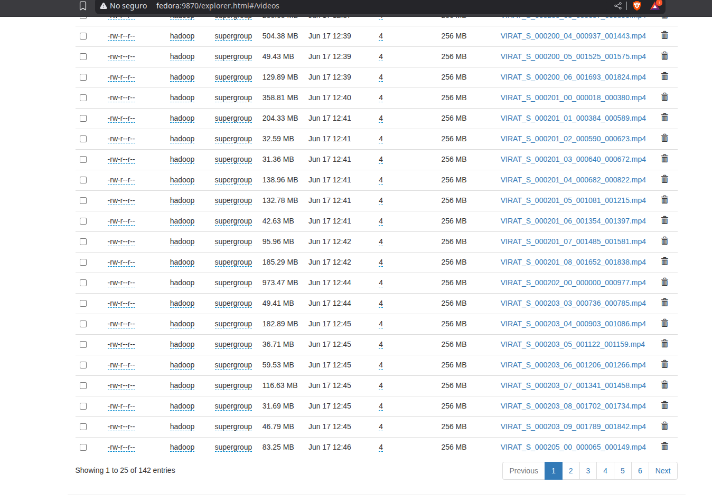
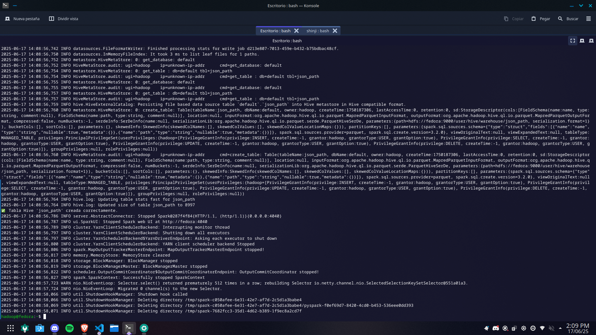

# Motor de Búsqueda usando Hadoop

Hecho por:

1. MALDONADO CASILLA, BRAULIO NAYAP
2. MOGOLLÓN CÁCERES, SERGIO DANIEL
3. PARIZACA MOZO, PAUL ANTONY
4. MARTÍNEZ CHOQUE, ALDO RAÚL
5. APAZA APAZA, NELZON JORGE

## 1. Introducción

Este informe describe el desarrollo de un motor de búsqueda distribuido utilizando el ecosistema de **Apache Hadoop**, **Hive** y **Apache Spark**. El sistema permite procesar grandes volúmenes de datos relacionados con videovigilancia, mediante la **subida de videos a HDFS** y la **carga de metadatos estructurados en tablas Hive**.

Se implementaron dos componentes principales: un **índice invertido** construido con Spark sobre Hive para una recuperación de información eficiente y completamente paralelizada, y un módulo de búsqueda que consulta directamente las tablas Hive para obtener los resultados. Todo el sistema se ejecuta sobre un clúster de al menos 4 nodos. A diferencia de soluciones tradicionales basadas en archivos JSON, este enfoque utiliza directamente **Hive como base de datos distribuida**, lo que mejora el rendimiento y escalabilidad del sistema.


## 2. Prerequisitos

### 2.1 Configuración del Clúster Hadoop

El clúster está compuesto por las siguientes versiones de software:

- Hadoop 3.3.6
- Hive 3.1.3
- Spark 3.2.0

Los archivos de configuración se encuentran en la carpeta `config` e incluyen:

- `core-site.xml`
- `hdfs-site.xml`
- `mapred-site.xml`
- `yarn-site.xml`
- `hive-site.xml`
- `hive-env.sh`
- `spark-defaults.conf`
- `spark-env.sh`

En todos los archivos, cualquier referencia al nombre de host **fedora** debe reemplazarse por el nombre del nodo **master** del clúster, ya que _fedora_ actúa como nodo maestro.
Además, en `hive-site.xml` se configura la conexión al servidor MySQL, ya sea de forma local o en la nube, para el funcionamiento del metastore de Hive.

#### 2.1.1 Topología y preparación

Clúster de cuatro nodos y Java 8:

| IP           | Hostname      |
| ------------ | ------------- |
| XX.XX.XX.XXX | fedora        |
| XX.XX.XX.XXX | debian        |
| XX.XX.XX.XXX | paul (master) |
| XX.XX.XX.XXX | aldo-nitro    |

#### 2.1.2 `workers`

```xml
paul
fedora
debian
aldo-nitro
```

### 2.1 Instalar Python 3.9.18 con `pyenv`

#### 1. Instalar dependencias necesarias

```bash
sudo dnf install -y gcc zlib-devel bzip2 bzip2-devel \
readline-devel sqlite sqlite-devel openssl-devel \
xz xz-devel libffi-devel make git
```

#### 2. Instalar y configurar `pyenv`

```bash
curl https://pyenv.run | bash
```

Agregar al final del archivo `~/.bashrc`:

```bash
export PATH="$HOME/.pyenv/bin:$PATH"
eval "$(pyenv init -)"
eval "$(pyenv virtualenv-init -)"
```

Actualizar el entorno:

```bash
source ~/.bashrc
```

Verificar que `pyenv` esté disponible:

```bash
pyenv --version
```

#### 3. Instalar Python y crear entorno virtual

```bash
pyenv install 3.9.18
pyenv virtualenv 3.9.18 pyspark-env
pyenv activate pyspark-env
```

#### 4. Instalar librerías necesarias

```bash
python3 -m pip install opencv-python ultralytics
```

#### 5. Verificar instalación

```bash
python3 -c "import cv2; print('OpenCV OK')"
python3 -c "from ultralytics import YOLO; print('Ultralytics OK')"
```

### 2.2 Configurar Spark con Python 3.9.18

Editar el archivo `~/.bashrc`:

```bash
nano ~/.bashrc
```

Agregar al final del archivo:

```bash
export PYSPARK_PYTHON="$HOME/.pyenv/versions/pyspark-env/bin/python"
export PYSPARK_DRIVER_PYTHON="$HOME/.pyenv/versions/pyspark-env/bin/python"
```

Actualizar el entorno:

```bash
source ~/.bashrc
```

Probar configuración abriendo Spark:

```bash
pyspark --master yarn
```

Y luego ejecutando en la consola de PySpark:

```python
import sys
print("Python executable:", sys.executable)
print("Python version:", sys.version)
```

La salida debe ser similar a:

```bash
>>> print(sys.executable)
/home/hadoop/.pyenv/versions/pyspark-env/bin/python
>>> print(sys.version)
3.9.18 (main, Jun 12 2025, 10:05:39)
[GCC 14.2.1 20240912 (Red Hat 14.2.1-3)]
```

### 2.3 Subir modelo YOLOv8 a HDFS

#### 1. Crear carpeta para modelos en HDFS

```bash
hdfs dfs -mkdir -p /models
```

#### 2. Subir modelo YOLOv8

```bash
hdfs dfs -put ./processVideo/yolov8n.pt /models/
```

#### 3. Verificar que el modelo esté en HDFS

```bash
hdfs dfs -ls /models
```

---

## 3. Modulo: Carga de Videos al HDFS

Automatiza la carga de videos a HDFS y deja una tabla Hive lista para consultas posteriores sin tener que manejar rutas manualmente.

### Pasos para ejecutar

1. Crea una carpeta llamada `videos` y coloca dentro todos los archivos `.mp4` que deseas subir.
2. Verifica que el script de la carpeta `processVideo`, `upload_videos_to_hive.py` esté en el mismo nivel que la carpeta `videos`.

```
|-- videos
|    |-- *.mp4
|-- upload_videos_to_hive.py
```

3. Ejecuta el script con Spark en modo YARN:

```bash
spark-submit --master yarn upload_videos_to_hive.py
```

Este script realizará las siguientes tareas:

- Subirá todos los videos al HDFS bajo `/videoss/`
- Creará (o reemplazará) una tabla de Hive llamada `videos_path`
- Esta tabla contendrá dos columnas: `name` (nombre del video) y `path` (ruta en HDFS)

### Flujo del `upload_videos_to_hive.py`:

1. **Inicia una sesión de Spark con soporte para Hive.**
   Permite ejecutar comandos SQL y guardar tablas en Hive.

2. **Elimina la carpeta `/videos` en HDFS si ya existe.**
   Esto asegura que no haya archivos antiguos.

3. **Sube todos los archivos `.mp4` desde la carpeta local `./videos` a HDFS** en `/videos`.

4. **Crea un DataFrame con el nombre y la ruta HDFS de cada video.**

5. **Elimina la tabla Hive `videos_path` si existe y crea una nueva** con los datos cargados.

6. **Muestra en consola el contenido de la tabla** para verificar que se cargaron correctamente.

### Salidas




---

## 4. Modulo: Procesamiento de Videos con YOLO

El archivo `process.py` de la carpeta `processVideo`, se encarga de analizar videos usando YOLOv8 y generar un resumen estructurado con información como:

- Nombre del video, cámara, ubicación, prioridad y fecha.
- Conteo de objetos por franjas horarias.
- Alertas detectadas (si hubiera).

```sql
video_name STRING,
camera_id INT,
location STRING,
priority STRING,
date STRING,
timeslots ARRAY<STRUCT<
    hour: STRING,
    object_counts: MAP<STRING, INT>
>>,
alerts ARRAY<STRING>
```

Los datos generados se guardan en una tabla Hive llamada `jsons`, lista para su análisis posterior.

### Ejecución

```bash
spark-submit --master yarn --num-executors <NUM_NODES> process.py
```

### Flujo del script `process.py`:

1. **Inicializa Spark con soporte Hive.**

2. **Crea tabla Hive `jsons`** con el esquema definido, almacenada en formato Parquet.

3. **Lee los paths de videos desde la tabla Hive `videos_path`.**

4. **Distribuye el procesamiento de videos entre los nodos** usando `.mapPartitions()`, donde:

   - Cada nodo descarga sus videos desde HDFS.
   - Usa YOLOv8 para detectar objetos.
   - Cuenta objetos por franjas horarias.
   - Retorna los resultados.

5. **Recoge los resultados procesados**:

   - Separa logs y resultados válidos.

6. **Inserta los resultados válidos en la tabla Hive `jsons`.**

### Salidas





---

## 5. Modulo: Indice Invertido

### Descripción General

Este proyecto integra Hadoop, Hive y Spark para procesar una gran cantidad de videos almacenados en el HDFS (Hadoop Distributed File System). El flujo de trabajo está dividido en módulos, siendo el primer módulo el encargado de procesar los videos y almacenarlos en una tabla de Hive. A partir de esta tabla, se genera un índice invertido que es procesado por el módulo de Spark. El índice invertido permite asociar palabras (entidades) a los videos en los que aparecen, facilitando la búsqueda y el análisis de los mismos.

### Estructura de la Tabla de Entrada: `jsons`

La tabla `jsons` contiene información sobre los videos, incluyendo metadatos como el nombre del video, ID de la cámara, ubicación, prioridad, fecha, franjas horarias y alertas. La estructura de la tabla es la siguiente:

| **Columna**  | **Tipo de Datos**                                              | **Descripción**                                                                                                 |
| ------------ | -------------------------------------------------------------- | --------------------------------------------------------------------------------------------------------------- |
| `video_name` | `STRING`                                                       | El nombre del archivo de video.                                                                                 |
| `camera_id`  | `INT`                                                          | El ID de la cámara que grabó el video.                                                                          |
| `location`   | `STRING`                                                       | La ubicación donde se grabó el video.                                                                           |
| `priority`   | `STRING`                                                       | La prioridad asociada al video, como "alta", "media", o "baja".                                                 |
| `date`       | `STRING`                                                       | La fecha en que se grabó el video.                                                                              |
| `timeslots`  | `ARRAY<STRUCT<hour: STRING, object_counts: MAP<STRING, INT>>>` | Un array de franjas horarias, cada una con la hora específica y un mapa de objetos detectados durante esa hora. |
| `alerts`     | `ARRAY<STRING>`                                                | Un array de alertas generadas durante la grabación del video.                                                   |

### Objetivo del Módulo

El objetivo de este módulo es procesar los datos contenidos en la tabla `jsons` de Hive y crear un índice invertido. Este índice asociará cada "entidad" (palabra) con los nombres de los archivos en los que aparece. La salida de este proceso se almacena en una nueva tabla de Hive llamada `invertedIndex`.

### Estructura de la Tabla de Salida: `invertedIndex`

La tabla de salida `invertedIndex` tiene la siguiente estructura:

| **Columna** | **Tipo de Datos** | **Descripción**                                                                                                    |
| ----------- | ----------------- | ------------------------------------------------------------------------------------------------------------------ |
| `entity`    | `STRING`          | Una palabra o entidad extraída del contenido del video. Este valor es una palabra que aparece en uno o más videos. |
| `files`     | `ARRAY<STRING>`   | Un array de nombres de archivos (videos) en los que aparece la entidad.                                            |

La tabla `invertedIndex` es el índice invertido que se genera a partir de la tabla `jsons`. En este índice, cada "entidad" (palabra) se asocia con los videos donde esa palabra aparece, lo que facilita realizar búsquedas eficientes en los datos.

### Proceso de Índice Invertido

1. **Entrada y Configuración de SparkSession**
   El programa comienza leyendo los datos de la tabla `jsons` de Hive. Se configura una `SparkSession` con soporte para Hive, lo que permite interactuar con Hive directamente.

   ```scala
   val spark = SparkSession.builder()
     .appName("Structured Inverted Index from Hive Table")
     .enableHiveSupport() // Conexión a Hive
     .getOrCreate()
   ```

2. **Lectura de los Datos de Hive**
   Utilizando la función `spark.table()`, se leen los datos de la tabla `jsons` de Hive y se cachea el DataFrame para optimizar el rendimiento si se va a usar varias veces.

   ```scala
   val sourceDF = spark.table(sourceTableName)
   sourceDF.cache()
   ```

3. **Extracción de Entidades de las Columnas**
   A continuación, se extraen las "entidades" de varias columnas de la tabla `jsons` y se unifican en un solo DataFrame. Para cada columna, se procesan los valores y se crean nuevas columnas para cada "entidad" encontrada.

   - **Entidades de la columna `location`**:
     Se dividen las ubicaciones en palabras y se procesan.

   - **Entidades de la columna `priority`**:
     Se procesan las prioridades en minúsculas.

   - **Entidades de la columna `date`**:
     Las fechas se utilizan directamente como entidades.

   - **Entidades de la columna `camera_id`**:
     Se convierte el `camera_id` a `STRING` y se procesa.

   - **Entidades de las columnas complejas**:
     Se "explotan" las columnas `timeslots` y `alerts` para extraer las horas y objetos de los mapas, así como las alertas.

   ```scala
   val locationEntities = sourceDF
     .where($"location".isNotNull)
     .select($"video_name", explode(split(lower($"location"), " ")).as("entity"))
     .filter($"entity" =!= "")

   val priorityEntities = sourceDF
     .where($"priority".isNotNull)
     .select($"video_name", lower($"priority").as("entity"))

   val dateEntities = sourceDF
     .where($"date".isNotNull)
     .select($"video_name", $"date".as("entity"))

   val cameraIdEntities = sourceDF
     .where($"camera_id".isNotNull)
     .select($"video_name", $"camera_id".cast("string").as("entity"))

   val timeslotsExploded = sourceDF
     .where($"timeslots".isNotNull)
     .select($"video_name", explode($"timeslots").as("timeslot"))

   val hourEntities = timeslotsExploded
     .select($"video_name", $"timeslot.hour".as("entity"))

   val objectEntities = timeslotsExploded
     .select($"video_name", explode(map_keys($"timeslot.object_counts")).as("entity"))

   val alertEntities = sourceDF
     .where($"alerts".isNotNull)
     .select($"video_name", explode($"alerts").as("entity"))
   ```

4. **Unificación de los DataFrames de Entidades**
   Los DataFrames resultantes de cada columna se combinan en un solo DataFrame usando la función `unionByName`, para formar un conjunto único de entidades con los correspondientes nombres de video.

   ```scala
   val allEntitiesDF = Seq(
     locationEntities,
     priorityEntities,
     dateEntities,
     cameraIdEntities,
     hourEntities,
     objectEntities,
     alertEntities
   ).reduce(_ unionByName _)
   ```

5. **Construcción del Índice Invertido**
   El índice invertido se construye agrupando las entidades y agregando los nombres de los videos en los que aparecen. Se eliminan duplicados para asegurarse de que cada entidad se asocie solo una vez con un video.

   ```scala
   val invertedIndexDF = allEntitiesDF
     .distinct()
     .groupBy("entity")
     .agg(collect_list("video_name").as("files"))
   ```

6. **Guardar el Índice Invertido en Hive**
   Finalmente, el DataFrame con el índice invertido se guarda en una nueva tabla de Hive llamada `invertedIndex`, sobrescribiendo cualquier tabla existente.

   ```scala
   invertedIndexDF.write
     .mode("overwrite") // Sobrescribir si la tabla ya existe
     .saveAsTable(targetTableName)
   ```

### Ejecución del Módulo

Para ejecutar el módulo de índice invertido en el clúster de Spark, se debe usar el siguiente comando `spark-submit` (el archivo esta en la carpeta `processVideo`):

```bash
spark-submit --class com.stdatalabs.SparkInvertedIndex.DriverToHive \
             --master yarn \
             target/SparkInvertedIndex-0.0.1-SNAPSHOT.jar
```

Este módulo es parte del flujo de trabajo que procesa grandes volúmenes de datos (videos) y genera un índice invertido útil para realizar búsquedas eficientes dentro de los videos almacenados en Hive. El siguiente módulo trabajara con esta tabla generada para realizar las consultas.

### Salida


---

## 6. Modulo: Backend

El módulo backend está compuesto por **dos microservicios independientes**, cada uno con responsabilidades específicas y ejecutándose en diferentes puertos. Esta arquitectura basada en microservicios permite escalar, mantener y desplegar cada servicio de forma autónoma.

### 6.1 Microservicio Video (Node.js)

Este microservicio está desarrollado en **Node.js** y tiene como propósito principal **transmitir videos almacenados en HDFS** al frontend, **por partes**, optimizando así el rendimiento en la carga y reproducción de los mismos.

- **Ubicación**: Carpeta `server/`
- **Puerto**: `5000`
- **Responsabilidad principal**: Transmitir videos desde **HDFS** al cliente mediante peticiones HTTP del tipo `Range`.

#### Funcionalidades clave:

- **Lectura parcial del video**:

  - El servicio interpreta la cabecera `Range` de la petición para enviar un segmento del video.
  - Esto permite implementar streaming eficiente sin tener que descargar el video completo.

- **Acceso a HDFS**:

  - Usa el cliente `webhdfs` para conectarse al sistema Hadoop y acceder a archivos de video ubicados en rutas como:
    `/user/hadoop/inputVideos/video.mp4`.

- **Manejo de errores**:

  - Valida que la ruta esté dentro del directorio permitido.
  - Si el archivo no existe en HDFS o no se puede acceder, retorna un error apropiado.

#### Código clave:

```js
const hdfsClient = webhdfs.createClient({
  user: "hadoop",
  host: "fedora",
  port: 9870,
  path: "/webhdfs/v1",
});
```

```js
res.writeHead(206, headers);
const hdfsStream = hdfsClient.createReadStream(videoPathInHDFS, streamOpts);
hdfsStream.pipe(res);
```

Este diseño es crucial para reproducir los videos directamente desde el frontend sin descargar archivos completos.

### 6.2 Microservicio Spark (FastAPI + PySpark)

Este segundo microservicio está desarrollado con **FastAPI** y utiliza **PySpark** para ejecutar consultas sobre las tablas gestionadas en Hive. Su objetivo es **proveer datos estructurados y filtrados al frontend** desde las tablas `videos_path`, `jsons` e `invertedindex`.

- **Ubicación**: Carpeta `spark-mcsv/`
- **Puerto**: `4000`
- **Responsabilidad principal**: Consultar y servir metadatos de los videos en base a filtros como entidad, prioridad o fecha.

#### Características principales:

- **Integración con Hive**:

  - El microservicio levanta una sesión de Spark con soporte para Hive (`enableHiveSupport()`), lo que permite consultar directamente tablas ya existentes.

- **Endpoints REST**:

  - `/videos`: Devuelve todos los registros de la tabla `videos_path`.
  - `/jsons`: Devuelve todos los metadatos de videos desde `jsons`.
  - `/invertedindex`: Devuelve el índice invertido (palabras clave a archivos).
  - `/videopath/{entityname}`: Devuelve los archivos de video asociados a una entidad.
  - `/videopath/{entityname}/orderbydate`: Devuelve los videos de una entidad ordenados por fecha descendente.
  - `/videopath/{entityname}/noorderbydate`: Lo mismo, pero sin ordenar.
  - `/videopath/{entityname}/priority/{priority_level}`: Devuelve videos de una entidad filtrando por prioridad (`High`, `Medium`, `Low`).
  - `/search?q=person,car`: Búsqueda múltiple de entidades, útil para obtener videos relacionados a más de una palabra clave.

#### Ejemplo de consulta SQL usada:

```sql
SELECT video_name, camera_id, location, priority, date, timeslots, alerts
FROM jsons
WHERE video_name IN ('file1.json', 'file2.json')
ORDER BY date DESC
```

#### Seguridad y CORS:

- Se configura middleware `CORS` para permitir peticiones desde `http://localhost:5173`, donde se encuentra alojado el frontend.

```python
app.add_middleware(
    CORSMiddleware,
    allow_origins=origins,
    allow_credentials=True,
    allow_methods=["*"],
    allow_headers=["*"],
)
```

#### Ventajas:

- Permite una **búsqueda eficiente** en el backend mediante Spark SQL.
- Facilita la **filtración y ordenación** de datos sin necesidad de procesamiento en el frontend.
- Escalable: gracias a PySpark, se puede migrar fácilmente a un clúster Hadoop si es necesario.

### Arquitectura General

| Microservicio | Tecnología               | Puerto | Función Principal                             |
| ------------- | ------------------------ | ------ | --------------------------------------------- |
| Video         | Node.js + HDFS           | 5000   | Transmitir videos por partes desde HDFS       |
| Spark-MCSV    | FastAPI + PySpark + Hive | 4000   | Consultar datos y metadatos desde tablas Hive |

Ambos servicios se comunican de forma indirecta a través del frontend, manteniendo así **desacoplamiento** y **modularidad**.

---

## 7. Módulo: Cliente - Frontend

Se desarrolló una interfaz de usuario utilizando **React**, la cual permite a los usuarios realizar búsquedas de manera sencilla, similar a un motor de búsqueda convencional.


Al ingresar una consulta en la página inicial, se emplea un pequeño módulo de **procesamiento de lenguaje natural (NLP)** que extrae las palabras clave relevantes. Estas palabras clave se envían al backend de microservicios, que se encarga de consultar los datos necesarios.

El frontend recibe del backend los resultados relacionados con la búsqueda, que incluyen información sobre los videos procesados.


Cada resultado incluye una previsualización del video correspondiente. Al hacer clic en uno de ellos, se carga el video completo mediante un sistema de **streaming con cabeceras HTTP tipo "Range"**, lo que permite transmitir fragmentos de aproximadamente 1 MB por segundo.

Los videos están almacenados directamente en **HDFS** y son transmitidos desde allí en tiempo real al usuario final.


---

## Ejecución del Sistema

### 1. Frontend (Cliente React)

Esto levantará la interfaz de usuario en modo desarrollo, generalmente accesible desde `http://localhost:5173`. En la carpeta `client`:

```bash
npm install
npm run dev
```

### 2. Backend (Servidor de Microservicios)

Esto inicia el backend en modo desarrollo, que se conecta a Hive para consultar los datos y a HDFS para servir los videos. En la carpeta `server`:

```bash
npm install
npm run dev
```

### 3. Procesamiento Distribuido (Spark)

Este comando ejecuta el módulo de procesamiento distribuido encargado de analizar los datos y generar las salidas necesarias para el sistema. En la carpeta `spark-mcsv`:

```bash
spark-submit main.py
```

### 4. Metastore de Hive

Este servicio debe estar activo para que el backend pueda acceder a las tablas de Hive correctamente. Asegúrate de que el `metastore` esté conectado a la base de datos MySQL configurada previamente. Para desplegar el metastore de Hive:

```bash
hive --service metastore
```


---

### 7. Problemas y Desafíos

1. **Ejecución de YOLO en cada nodo esclavo**

   - **Problema**: La ejecución del modelo YOLO en cada nodo podía causar sobrecarga de memoria, especialmente si se procesaban varios videos en paralelo.
   - **Desafío**: Garantizar que cada nodo pueda ejecutar el modelo de forma eficiente, con un uso mínimo de recursos, evitando que la memoria virtual del sistema se sature.

2. **Conexión entre HDFS y el backend**

   - **Problema**: El backend requería acceso tanto a los archivos de salida generados en HDFS como a las tablas de Hive.
   - **Desafío**: Diseñar una integración estable entre el backend y el ecosistema Hadoop, asegurando que las rutas a archivos y datos estén correctamente sincronizadas, y que las operaciones de lectura no afecten el rendimiento.

3. **Flujo de datos desde HDFS hacia el backend**

   - **Problema**: Se necesitaba leer los metadatos desde Hive y asociarlos correctamente con los archivos JSON y videos almacenados en HDFS.
   - **Desafío**: Implementar un flujo robusto y eficiente que permitiera al backend combinar ambos orígenes (Hive y HDFS), garantizando consistencia entre los datos analíticos y los archivos multimedia.

4. **Optimización de las consultas de búsqueda**

   - **Problema**: Las búsquedas realizadas desde el frontend podían tardar debido al volumen de datos almacenados.
   - **Desafío**: Mejorar el rendimiento de las consultas mediante mecanismos de cacheo, estructuras de datos intermedias y consultas eficientes a Hive, de forma que se redujera el tiempo de respuesta sin comprometer la integridad de los resultados.

5. **Integración del backend con el frontend (React)**

   - **Problema**: El frontend requería consumir los resultados de búsqueda generados por el backend para mostrar videos y estadísticas al usuario.
   - **Desafío**: Asegurar una comunicación fluida y de bajo tiempo de espera entre el backend (FastAPI y Node.js) y el frontend (React), manejando correctamente los formatos de respuesta, errores y tiempos de carga para una experiencia de usuario fluida.

---

### 8. Conclusiones

Se implementó exitosamente un sistema distribuido utilizando **Hadoop**, capaz de procesar grandes volúmenes de datos y archivos de video de manera eficiente. Usando **HDFS** como base de almacenamiento, se diseñó un flujo de trabajo distribuido donde un backend basado en **FastAPI** y **Node.js** puede acceder tanto a las tablas de Hive como a los archivos de HDFS.

El sistema permite al frontend realizar búsquedas dinámicas y visualizar videos procesados con anotaciones generadas por **YOLOv8**. Esto demuestra que Hadoop no solo es útil para procesamiento de datos a gran escala, sino también como una base central distribuida que soporta aplicaciones web modernas con capacidades de análisis, recuperación de información y transmisión multimedia.

### 9. Equipo de trabajo

| Nombre                               | Porcentaje | Actividad realizada                                                                                      |
| ------------------------------------ | ---------- | -------------------------------------------------------------------------------------------------------- |
| **Maldonado Casilla, Braulio Nayap** | 20%        | Implementación de YOLO para procesamiento de videos y carga de resultados a Hadoop mediante Spark y Hive |
| **Mogollón Cáceres, Sergio Daniel**  | 20%        | Desarrollo del backend y conexión entre el frontend, Hive y HDFS                                         |
| **Parizaca Mozo, Paul Antony**       | 20%        | Desarrollo del índice invertido utilizando Spark y almacenamiento en Hive sobre Hadoop                   |
| **Martínez Choque, Aldo Raúl**       | 20%        | Implementación del frontend con React y diseño de la interfaz de usuario                                 |
| **Apaza Apaza, Nelzon Jorge**        | 20%        | Implementación del módulo de procesamiento de lenguaje natural (NLP) para extracción de palabras clave   |

## License

This project is licensed under the MIT License. See the [LICENSE](LICENSE) file for details.
