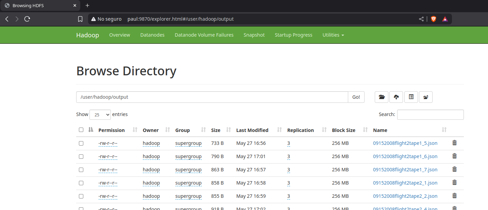
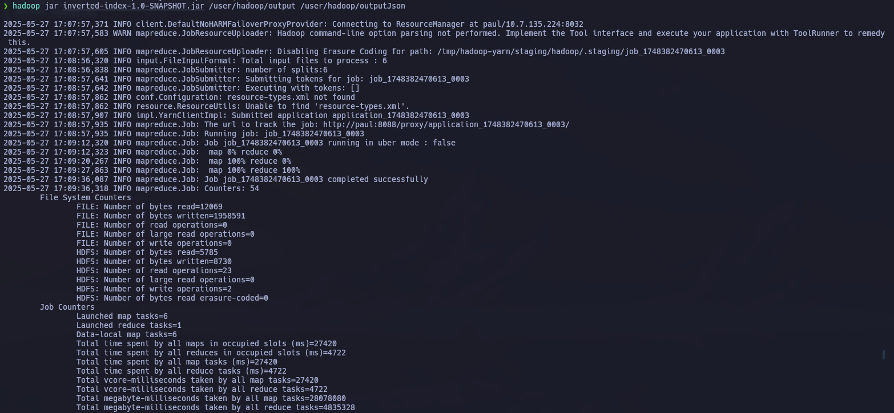
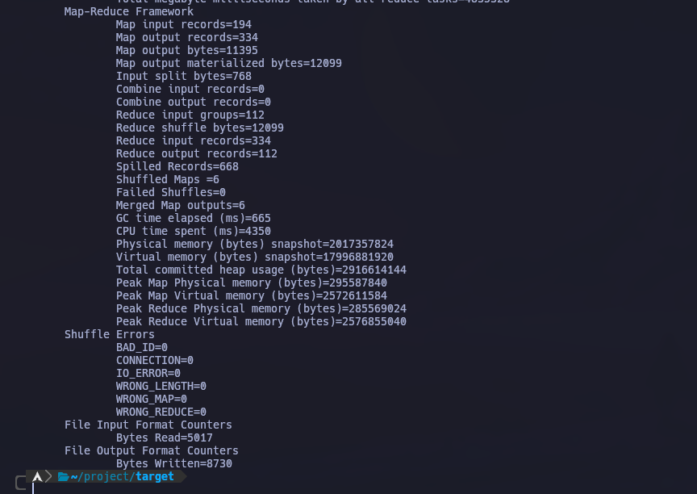
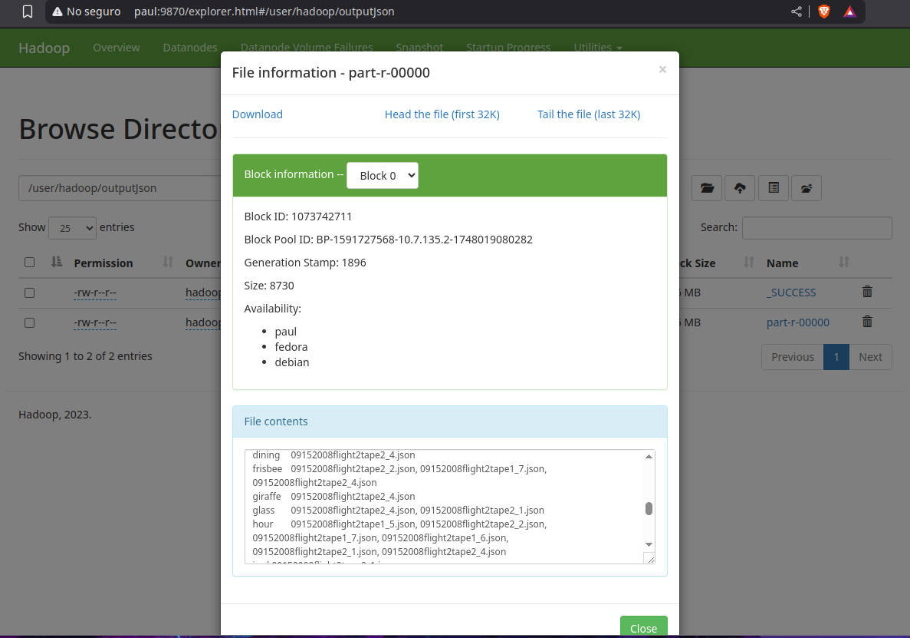
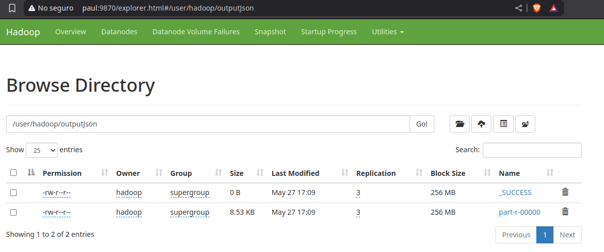

## Modulo: Indice Invertido

Este flujo de trabajo tiene como objetivo la creación de un índice invertido a partir de los metadatos de videos almacenados en archivos JSON. El proceso se lleva a cabo en un entorno Hadoop utilizando MapReduce. Los archivos JSON contienen información relevante sobre los videos, y el índice invertido se construye a partir de las palabras y fechas presentes en dichos metadatos.

### Flujo de Trabajo:

1. **Generación de los archivos JSON**:
   En un proceso previo, se generan archivos JSON que contienen la metadata de los videos, estos archivos se colocan en el directorio `/user/hadoop/output` dentro de HDFS.

2. **Ejecutando el comando de Hadoop**:
   Se ejecuta el siguiente comando para crear el índice invertido:

   ```
   hadoop jar inverted-index-1.0-SNAPSHOT.jar /user/hadoop/output /user/hadoop/outputJson
   ```

   Este comando procesa los archivos JSON de metadatos que están en `/user/hadoop/output` y genera el índice invertido en el directorio `/user/hadoop/outputJson` de HDFS.

3. **Procesamiento posterior**:
   Una vez generado el índice invertido, el backend de la aplicación tomará los archivos en `/user/hadoop/outputJson` para realizar el procesamiento adicional y generar la información que se utilizará en el análisis de los datos.

Ahora, el proceso de MapReduce que hemos implementado consta de tres clases principales:

* **InvertedIndexMapper.java**: Esta clase es responsable de mapear los datos de entrada y extraer las palabras y fechas relevantes.
* **InvertedIndexReducer.java**: Esta clase agrupa las palabras por su aparición en los documentos y construye el índice invertido.
* **InvertedIndexDriver.java**: Es el controlador que configura y ejecuta el trabajo de MapReduce.

### Código de las Clases

A continuación se muestra el código completo de cada una de las clases mencionadas.

---

### **1. InvertedIndexMapper.java**

```java
package com.example;

import java.io.IOException;
import java.util.StringTokenizer;
import java.util.regex.Matcher;
import java.util.regex.Pattern;

import org.apache.hadoop.io.LongWritable;
import org.apache.hadoop.io.Text;
import org.apache.hadoop.mapreduce.Mapper;
import org.apache.hadoop.mapreduce.lib.input.FileSplit;

public class InvertedIndexMapper extends Mapper<LongWritable, Text, Text, Text> {

  private Text word = new Text();
  private Text documentId = new Text();
  // Patrón para fechas como DD-MM-AA o similares (ajusta si es necesario)
  private Pattern datePattern = Pattern.compile("\\b\\d{2}-\\d{2}-\\d{2}\\b");

  @Override
  protected void map(LongWritable key, Text value, Context context) throws IOException, InterruptedException {
    // Obtener el nombre del archivo
    FileSplit fileSplit = (FileSplit) context.getInputSplit();
    String filename = fileSplit.getPath().getName();
    documentId.set(filename);

    String line = value.toString().toLowerCase();

    // 1. Extraer y procesar fechas primero
    Matcher dateMatcher = datePattern.matcher(line);
    while (dateMatcher.find()) {
      word.set(dateMatcher.group());
      context.write(word, documentId);
    }
    // Remover fechas para no procesarlas de nuevo y limpiar caracteres no deseados
    line = dateMatcher.replaceAll(" ");
    line = line.replaceAll("[{}:\",]", " "); // Ignora {}, :, "", y también puntos y comas.

    // 2. Tokenizar el resto
    StringTokenizer itr = new StringTokenizer(line);
    while (itr.hasMoreTokens()) {
      String token = itr.nextToken();

      // Verificar si el token es válido (no vacío y contiene alfanuméricos)
      if (token.matches(".*[a-z0-9].*")) {
        word.set(token);
        context.write(word, documentId);
      }
    }
  }
}
```

### **2. InvertedIndexReducer.java**

```java
package com.example;

import java.io.IOException;
import java.util.HashSet;
import java.util.Set;

import org.apache.hadoop.io.Text;
import org.apache.hadoop.mapreduce.Reducer;

public class InvertedIndexReducer extends Reducer<Text, Text, Text, Text> {

  private Text result = new Text();

  @Override
  protected void reduce(Text key, Iterable<Text> values, Context context)
      throws IOException, InterruptedException {
    Set<String> documentSet = new HashSet<>();
    // Usar un Set para evitar duplicados de nombres de archivo para la misma
    // palabra
    for (Text val : values) {
      documentSet.add(val.toString());
    }

    // Construir la cadena de documentos
    StringBuilder docList = new StringBuilder();
    boolean first = true;
    for (String docId : documentSet) {
      if (!first) {
        docList.append(", ");
      }
      docList.append(docId);
      first = false;
    }

    result.set(docList.toString());
    context.write(key, result);
  }
}
```

### **3. InvertedIndexDriver.java**

```java
package com.example;

import org.apache.hadoop.conf.Configuration;
import org.apache.hadoop.fs.Path;
import org.apache.hadoop.io.Text;
import org.apache.hadoop.mapreduce.Job;
import org.apache.hadoop.mapreduce.lib.input.FileInputFormat;
import org.apache.hadoop.mapreduce.lib.output.FileOutputFormat;
import org.apache.hadoop.fs.FileSystem;

public class InvertedIndexDriver {

  public static void main(String[] args) throws Exception {
    Configuration conf = new Configuration();
    Job job = Job.getInstance(conf, "Inverted Index Hadoop 3.3.6");

    job.setJarByClass(InvertedIndexDriver.class);
    job.setMapperClass(InvertedIndexMapper.class);
    job.setReducerClass(InvertedIndexReducer.class);

    job.setOutputKeyClass(Text.class);
    job.setOutputValueClass(Text.class);

    // Usar Text.class para Mapper si emite Text, Text
    job.setMapOutputKeyClass(Text.class);
    job.setMapOutputValueClass(Text.class);

    Path inputPath = new Path(args[0]);
    Path outputPath = new Path(args[1]);

    // Asegurarse de que el directorio de salida no exista
    FileSystem fs = FileSystem.get(conf);
    if (fs.exists(outputPath)) {
      fs.delete(outputPath, true); // true para borrar recursivamente
      System.out.println("Directorio de salida existente borrado: " + outputPath);
    }

    FileInputFormat.addInputPath(job, inputPath);
    FileOutputFormat.setOutputPath(job, outputPath);

    System.exit(job.waitForCompletion(true) ? 0 : 1);
  }
}
```

---

* **InvertedIndexMapper**: Mapea cada línea de los archivos JSON, extrayendo las palabras clave y las fechas. Cada palabra o fecha se asocia con el documento en el que se encuentra.
* **InvertedIndexReducer**: Recibe las palabras clave emitidas por el Mapper y las agrupa por documento, eliminando duplicados. Luego, construye una lista de documentos que contiene cada palabra.
* **InvertedIndexDriver**: Es el encargado de configurar y ejecutar el trabajo de MapReduce en Hadoop, manejando los directorios de entrada y salida.

---

### Ejecución del Índice Invertido en Hadoop

Una vez configurado el flujo de trabajo y ejecutado el trabajo MapReduce en Hadoop, se genera el índice invertido basado en los archivos de metadatos de los videos (JSON). A continuación, se muestra cómo se ve el flujo de datos desde la entrada hasta la salida:

#### 1. **Directorio de Entrada (Input JSON)**

El directorio `/user/hadoop/output` contiene los archivos de entrada con los metadatos de los videos en formato JSON. Esta es la entrada de nuestro trabajo MapReduce, donde cada archivo JSON contiene información relevante sobre los videos. A continuación, se muestra cómo se ve este directorio:



#### 2. **Ejecución del Comando Hadoop**

El siguiente paso es la ejecución del comando Hadoop que inicia el trabajo MapReduce. Las siguientes imágenes muestran los logs de la ejecución de este proceso, donde se puede ver cómo el trabajo se lanza, los mapas y reduce completados, y las estadísticas de procesamiento.

##### **Parte 1 de la Ejecución del Jar**



##### **Parte 2 de la Ejecución del Jar**




#### 3. **Índice Invertido Generado**

Una vez que el trabajo MapReduce ha sido ejecutado, se genera un índice invertido. Este índice lista las palabras o fechas junto con los documentos (en este caso, los archivos JSON) en los que se encuentran. A continuación se muestra un ejemplo del índice invertido generado:



#### 4. **Salida del Trabajo MapReduce (Output JSON)**

Después de la ejecución del trabajo, los resultados se almacenan en el directorio `/user/hadoop/outputJson`. Este directorio contiene los archivos con los resultados del índice invertido, que serán procesados por el backend para análisis adicionales. A continuación, se muestra cómo se ve este directorio:



### Resumen del Flujo

1. **Archivos de Entrada**: Los archivos JSON de metadatos de los videos son cargados en el directorio `/user/hadoop/output`.
2. **Procesamiento con Hadoop**: El trabajo MapReduce es ejecutado con el comando `hadoop jar inverted-index-1.0-SNAPSHOT.jar /user/hadoop/output /user/hadoop/outputJson`, que genera el índice invertido.
3. **Índice Invertido**: El resultado es almacenado en el directorio `/user/hadoop/outputJson`, el cual contiene las listas de documentos indexados por cada palabra o fecha.

Este proceso crea un índice eficiente para buscar y analizar las palabras o fechas en los metadatos de los videos.
